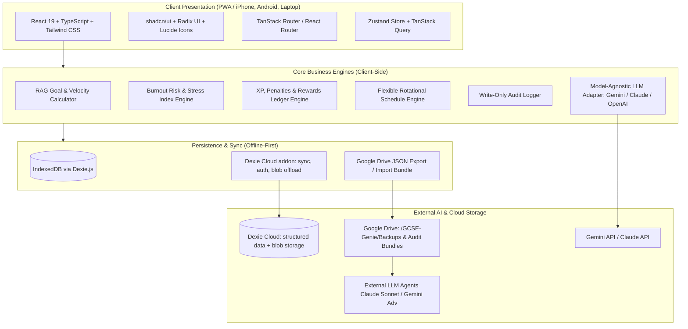
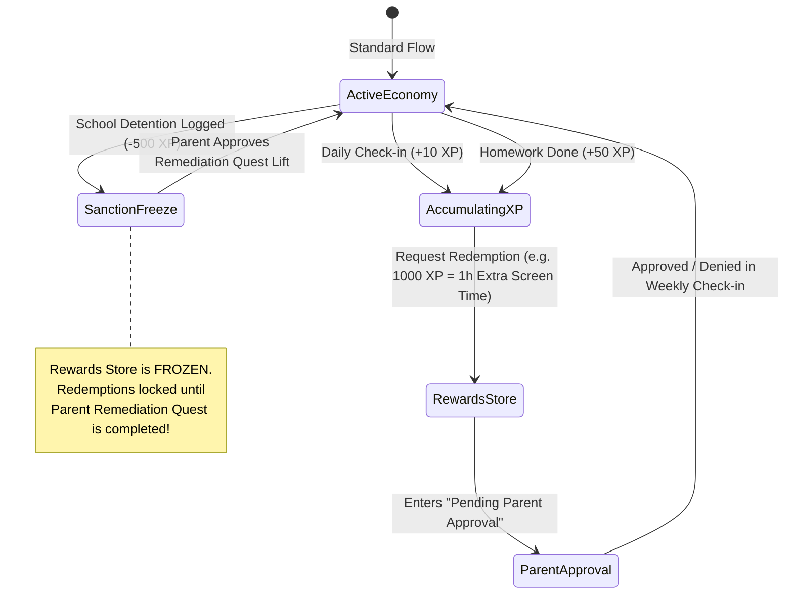

# GCSE Genie: Master Architecture Specification & Technical Blueprint (v1.1)
**Tailored for Tejas Dilip (GCSE Year 10, Guildford County School)**  
**Target Milestone: GCSE Grade 9 Excellence across all subjects**  
**Cross-Platform Parity: iPhone (Student) | Android (Parents) | Laptop (Desktop PWA)**

---


## Activity, comments and automatic backup (v12-v14, September 2026)

**Two logs, merged at read time.** `auditLogs` is complete and hash-chained;
`changeLog` is human-readable but only covers what passed a confirmation sheet.
`activityService.buildActivityFeed` merges them - audit as the backbone, changeLog
supplying wording and sign-off state. Correlation is by `changeLog.entityId`
where present, falling back to a tight time-and-category window for rows written
before that field existed. **Nothing writes to `auditLogs`**; rewriting a chained
log to read more nicely destroys the only property it has.

**Identity is a device, grouped by a person.** `deviceRegistry` (v12) maps the
`deviceId` already on every audit row to a label and an optional `ownerName`.
Names therefore apply retroactively. `toJSON(vars)`-style enumeration caveat
aside, the model is deliberately honest: it identifies a device, never a human.

**Drive access is device-local.** `driveSync` (v13) is in `unsyncedTables` - a
folder handle is a capability granted to one browser profile and an OAuth token
is a credential, neither of which means anything on another device. The handle
itself lives outside Dexie entirely, in `folderHandleStore`, because it is a live
object that structured-clone rejects everywhere except the browsers that
implement the API.

**Backups run at app open**, never on a timer: a backgrounded phone tab makes
`setInterval` a promise the browser will not keep. Retention keeps the newest 30,
prunes only after a successful write, matches an anchored filename pattern, and
excludes the file just written - clock skew across devices makes name-sorting
alone unsafe.

**OAuth is Google Identity Services, not an authorization-code flow.** Google's
token endpoint requires `client_secret` for a Web application client, and the
client types permitting PKCE without one cannot legitimately be driven from a web
page. The consequence is architectural: **no refresh token**, so mobile backup is
automatic only while a token can be obtained.

**Comments attach to the ActivityItem id** (v14), not to the record. A task may be
deleted; the question asked about the moment it completed is still fair and still
has an answer.

**Non-exam subjects.** `general` and `revision` keep `subjectId` non-null so no
analysis has to interpret a blank. They are excluded from RAG health - with no
topics the weighted score would default to a meaningful-looking number that moves
only with homework - and included in workload, because the time is real.

## Plan baselining and tiered sanctions (v15, November 2026)

**A week is a record, not a filter.** `planBaselines` is keyed by the week's
Monday, so the row for a week is findable without a query and a week cannot
baseline twice. The committed task ids are *captured* at submission rather than
recomputed at approval: what a parent agrees to must be exactly what was on
screen when it was sent, and approving a moving target is not approving
anything.

**Amendments are rows, not an array on the baseline.** Two devices can both add
work to an approved week while offline. Dexie Cloud merges rows; it does not
merge an array inside one, so the second device's amendment would silently
overwrite the first's. They sort by `at` then by `id` - ids are random UUIDs
carrying no chronology, so without the tiebreak two amendments sharing a
millisecond come back in whatever order the index yields and the list reshuffles
between renders. Arbitrary but stable beats arbitrary and moving.

**Readiness is computed, never stored.** `readinessChecks` derives everything
from the current tables, so a stale check cannot outlive the thing it was about.
Blocking and advisory are distinguished: a week over its headroom, or work with
no goal behind it, is stated and submitted anyway. Refusing would push the
planning outside the app, and a planner nobody uses measures nothing.

**One reader for the nudge.** `readFinalisationState` assembles the checklist,
the status and the dashboard reminder in a single pass. Two components each
deriving "what is outstanding" from the same tables is how they drift apart, and
a nudge that contradicts the screen it links to is worse than no nudge.

**Goal drift is measured in hours.** One unattached four-hour task matters more
than three fifteen-minute ones; counting rows hides exactly that. It is a
warning and never a block - a permission slip belongs to no goal.

**Sanction tiers are a table, not a judgement.** `SANCTION_TIERS` fixes the
penalty and the freeze per severity. Escalation adds one tier for a repeat inside
14 days - one tier, once, never compounding, because a run of three small things
reaching a frozen shop is where a rule stops being believed. `severityOf` reads
rows written before tiers existed as SERIOUS, which is the rate they were logged
at, so they still escalate correctly. `requiresRemediation` tracks `freezesShop`
exactly: a freeze with no way to end it is a punishment with no exit.

**Dates go through `utils/date`, never `toISOString`.** The escalation window and
the week start both compare local ISO strings. Deriving them with `toISOString`
resolves in UTC, which east of Greenwich lands a day early - the window silently
reached fifteen days back and a sanction that should have aged out still
escalated the next one.

## Planned activities and the headline line (v16, November 2026)

**Activities are counts, not occurrences.** One row says "4 days of school",
because that is how a week is described out loud and one row per occasion makes
an ordinary week tedious to enter - which means it does not get entered, and an
empty table is worse than a rough one.

**Recurring commitments are derived, never stored.** The first version seeded a
copy of each into `plannedActivities`, and that copy was the only thing the panel
could see while `calculateBurnoutCapacity` read `commitments` and
`commitmentExceptions` - two records of one fact, one of them decorative. It
could not be edited, and confirming it at a check-in moved the panel while the
gauge carried on charging for lessons nobody attended.

`derivedActivities` now reads the occasions from the timetable and the misses
from the exception rows the gauge itself deducts from, so the two cannot
disagree. `bespokeActivityHours` - typed-in rows only - is the single figure the
gauge adds, and it filters `fromCommitmentId` defensively so a surviving copy
can never be counted. `purgeSeededActivities` clears those copies on open.

**A forecast is not a record.** `expectedHours` falls back to the plan until
`actualOccasions` is set, because an unconfirmed activity has not been shown to
be missed - it has only not been asked about. Treating silence as absence would
hand back hours nobody freed up. `isConfirmed` tests for the number's presence
rather than its truthiness, so a confirmed zero is a confirmation and not a gap.

**The check-in owns the confirmation** because it is the one moment someone is
already telling the app how the day went. It asks from midweek only, and stops
once every row is answered: a question with a known answer trains people to skim
the form, which costs the check-in rather than just the question.

**Feasibility composes rather than extends.** `assessFeasibility` reads the
burn-down, the capacity gauge and the activity load and compares a required rate
to real headroom. It lives beside `portfolioBurndown` but does not alter it, so
the existing burn-down tests keep testing the burn-down. Only goals with negative
variance contribute to the rate - counting a healthy goal's steady budget would
manufacture a shortfall from a plan that is going well.

**The ticker reads, never writes.** `headlineMetrics.readHeadlines` issues its
reads in one `Promise.all`; it runs on every Home render, and eight sequential
awaits is a visible pause on the most-opened screen. Items are omitted rather
than zeroed, each carries a `tone` separate from its text, and the marquee
renders two copies translated by exactly -50% so the loop has no seam. Motion
respects `prefers-reduced-motion`, pauses on hover and focus, and the accessible
copy is a plain `sr-only` list - a marquee announced on a loop is unusable.

## The week health score (November 2026)

**Composed, never recomputed.** `readWeekHealth` reads `goalProgress`,
`planService`, `planBaselineService` and `burnoutEngine` and adds nothing of its
own. Every figure keeps one owner; the alternative is the failure mode this
codebase has already hit once, where a second copy of a number drifted from the
first and the screen reported hours the gauge was still charging for.

**Signals can be inapplicable, and that is not zero.** `notApplicable` drops a
signal out of the weighted mean entirely rather than scoring it zero. Without it
a family with no approved goals fails three signals for one problem and the
score reports a crisis three times over.

**The band is not the mean.** `overallStatus` caps the result at amber while any
signal is red, and returns red outright at two. A weighted mean will happily
average one genuine failure into a comfortable green, which is precisely when a
health score does harm rather than nothing.

**Pro-rated by weekday, like `goalProgress` already is.** Nothing is called red
for being behind before Wednesday. A goal is "behind" at one minute past midnight
on Monday, which is true and useless.

**The headline names the concern, not the colour.** A letter with no sentence is
a number to argue about; the sentence is the part that can be acted on.

## 1. Executive Summary & System Philosophy

**GCSE Genie** is a private, offline-first, zero-administrative-overhead academic organiser and performance acceleration platform. It is engineered specifically for Tejas Dilip as he embarks on his two-year GCSE journey (Years 10–11) at Guildford County School (GCS), targeting **Grade 9s** across all six core and elective subjects.

```
+--------------------------------------------------------------------------------------------------+
|                                           GCSE GENIE                                             |
|                                                                                                  |
|  +-----------------------------------+    +---------------------------------------------------+  |
|  |       STUDENT PORTAL (iPhone)     |    |              PARENT PORTAL (Android / PC)         |  |
|  |  * <2-Min Daily Fast Check-in     |    |  * Secure PIN-Protected Mode Switch / Auth        |  |
|  |  * Grade 9 Goal RAG Visualizer    |    |  * Reward Redemption Approval Ledger              |  |
|  |  * Configurable 08:30 Timetable   |    |  * Schedule Overrides & Sanction Logger           |  |
|  |  * Remediation Quests (+XP)       |    |  * Model-Agnostic Agentic Audit (Gemini / Claude) |  |
|  |  * Career & Guidance Hub          |    |  * Change History Viewer (per-entry hash)            |  |
|  +-----------------+-----------------+    +-------------------------+-------------------------+  |
|                    |                                                |                            |
|  +-----------------v------------------------------------------------v-------------------------+  |
|  |                                  CORE APPLICATION ENGINES                                  |  |
|  |  [Burnout Heatmap / 60h Limit] [MoSCoW Prioritization] [XP Economy] [RAG Metric Calculator] |  |
|  +---------------------------------------------+----------------------------------------------+  |
|                                                |                                                 |
|  +---------------------------------------------v----------------------------------------------+  |
|  |                       OFFLINE-FIRST DATA & GOOGLE DRIVE SYNC LAYER                         |  |
|  |         IndexedDB (Dexie.js) + JSON Backup/Restore via Google Drive + Model-Agnostic LLM   |  |
|  +--------------------------------------------------------------------------------------------+  |
+--------------------------------------------------------------------------------------------------+
```

---

## 2. Core Architectural Principles & Constraints

1. **Privacy & Zero-School Integration**:
   - Zero integration with external school platforms (Sparx, Bromcom, MCAS, Microsoft Teams).
   - All data is entered manually by Tejas or his parents. No teacher access, no analytics, no telemetry.
   - **Amended August 2026.** The original "absolute data isolation" no longer holds: sync is provided
     by Dexie Cloud, so once a user signs in, records leave the device for that service. This was a
     deliberate trade to make parent oversight work across devices — the previous design left reward
     approvals and sanctions functioning only on the student's own phone. Sync is optional and off
     until login; the LLM API key is excluded from it permanently.

2. **Ultra-Low Friction (<2 Minute Daily Overhead)**:
   - One-tap check-in buttons, preset sliders, and rapid homework check-offs.
   - Automated timetable population (Odd/Even GCS rotational calendar with 08:30 start).
   - Context-aware defaults to eliminate repetitive typing.

3. **Cross-Platform Device Parity (iPhone + Android + Laptop)**:
   - **Tejas's Device (iPhone / iOS Safari PWA)**: Safe-area insets (`env(safe-area-inset-*)`), iOS standalone display mode, touch target sizes $\ge 44\text{px}$, WebKit IndexedDB persistence.
   - **Parent Devices (Android Chrome PWA)**: Modern Material/Tailwind responsive UI, Android Google Drive file picker integration, install prompt banner.
   - **Laptops (PC / Mac Chrome / Edge)**: Multi-column responsive layout, drag-and-drop schedule builders, detailed RAG drill-down dashboards.
   - **Sync Strategy**: Dexie Cloud (offline-first, operation-log based, per-record conflict
     resolution). JSON export/import to Google Drive is retained as *backup*, not as the sync
     mechanism — it is a whole-database replace and was never safe as a reconciliation strategy.

4. **Model-Agnostic Agentic Audit & Google Drive Path Integration**:
   - Supports **Google Gemini**, **Anthropic Claude** (default `claude-opus-5`) and **OpenAI**
     (default `gpt-4o`). All three now have working execution paths; see 8.4.
   - **In-App Execution**: Direct API call using parent's stored key.
   - **External Drive-Based Execution**: One-click "Export Agent Audit Bundle" to the designated Google Drive path containing:
     * `audit_manifest.json`
     * `activity_logs_14d.json`
     * `time_budget_matrix.json`
     * `remediation_status.json`
     * `agent_instructions_prompt.md` (Ready for any external LLM terminal or web interface to evaluate).

5. **Checksummed Change Log** *(renamed from "Tamper-Evident Immutable Audit Trail")*:
   - Every state mutation — creation, score update, XP award, sanction, **and deletion** — writes a row
     carrying a SHA-256 of its own payload.
   - It is **not** hash-chained and rows remain deletable, so it is not tamper-evident. The original
     wording overstated the guarantee; see 8.3.

---

## 3. Technology Stack & System Architecture



| Layer | Recommended Technology | Justification |
| :--- | :--- | :--- |
| **Frontend Framework** | **React 19 + TypeScript + Vite** | Fast, type-safe, component-driven, high performance on mobile & desktop |
| **Styling & UI Kit** | **Tailwind CSS + shadcn/ui + Lucide Icons** | Clean, modern, accessible design with dark/light mode and mobile touch targets |
| **State Management** | **Zustand** | Lightweight, boilerplate-free state store with local persistence middleware |
| **Local Data Store** | **IndexedDB via Dexie.js 4** | Robust client-side database with reactive queries, schema migrations, and high capacity |
| **Cross-Device Sync** | **Dexie Cloud (`dexie-cloud-addon`)** | Layers onto the existing Dexie schema; operation-log sync, per-record conflict resolution, email/OAuth auth, automatic blob offload |
| **Backup** | **Google Drive JSON Bundle** | Schema-walking whole-database export; disaster recovery and portability, not sync |
| **PWA & Offline** | **Vite PWA Plugin (Workbox)** | Full offline asset caching, app-like standalone installation on iOS/Android/PC/Mac |
| **Charts & Visuals** | **Recharts + Lucide** | RAG gauges, time-capacity heatmaps, XP progression bars, and diagnostic radar charts |
| **Model-Agnostic AI Adapter** | **Gemini / Claude / OpenAI REST SDK** | Pluggable architecture supporting multiple LLM providers for in-app or file-based audits |

---

## 4. Subsystem & Module Breakdown

### 4.1. Module 1: Student Daily Dashboard & Rapid Check-in (<2 min)

The dashboard is ordered by **daily frequency of use**, not by conceptual importance:

1. **"What's next" card** — overdue work first, then due today, then the next seven days, with
   upcoming key dates counting down beneath. Tasks are tickable in place. This answers the question
   the app is opened to answer and therefore sits above everything else.
2. **"Log today" banner** — opens the check-in.
3. **Today's schedule + active quests** — contextual, side by side.
4. **Weekly time capacity gauge** — a status readout, not a daily action, so it sits last.

- **Quick-Toggle Check-in**: energy (1–5), focus, tap-to-complete homework list, study-time slider,
  and three structured log questions. Multiple sessions per day (Morning / Afternoon / Study /
  Evening); the daily base XP is awarded only on the first.
- **Quick Add**: a floating action button present on *every* screen opens a single sheet that adds
  either a homework task or a key date. Three required fields; priority, category and notes are
  collapsed behind *More options*. Adding is the second most frequent action after checking in, so
  it deliberately does not live inside a particular tab.
- **Active Quests Strip**: Shows pending Year 9 remediation actions with live XP rewards.
- **Real-Time Streak Engine**: Streak and XP in the header; confetti on completion. (Haptics are
  specified but not yet implemented.)

> **Navigation tiers.** Sections are split into `daily` (Home, My Work, Key Dates, Fix My Mistakes)
> and `weekly` (Rewards, Timetable, Subjects & Goals, Help & Careers, Parent Portal). On mobile the
> daily four form the bottom bar and the rest sit behind a **More** sheet; on desktop a `WEEKLY`
> divider separates them. Goal creation and amendment is explicitly a weekly-tier activity.
> The XP badge in the header doubles as a shortcut into the Rewards shop so that spending XP stays
> one tap away without consuming a navigation slot.

---

### 4.2. Module 2: Grade 9 Academic Curriculum & RAG Goal Hierarchy

Hardcodes the exact exam boards and structures for Tejas's subjects:

```mermaid
graph TD
    Target[Ultimate Goal: Straight Grade 9s across all 6 GCSEs]
    
    Target --> M[Edexcel Maths (Linear 9-1)]
    Target --> E[AQA English Lang & Lit]
    Target --> S[AQA Separate Science (Bio, Chem, Phys)]
    Target --> H[AQA History]
    Target --> CS[OCR Computer Science]
    Target --> A[AQA Art, Craft & Design]
    
    M --> M1[3x 1.5h Written Papers]
    S --> S1[6x 1h45m Papers + 21 Required Practicals]
    H --> H1[America / Conflict & Tension / Health / Normans]
    CS --> CS1[Comp 1 Systems + Comp 2 Algorithms + Improvement Log]
    A --> A1[60% Portfolio + 40% Externally Set 10h Exam]
    
    M1 --> TasksM[Curriculum Topics & Remediation Actions]
    S1 --> TasksS[Practicals & Unit Conversions]
    CS1 --> TasksCS[Homework Streak & Programming Logic]
```

#### RAG Status Health Metric Formula

**As implemented** (`src/services/ragCalculator.ts`):
$$\text{Health}(S) = 0.40 \times \text{HW\_Rate}(S) + 0.35 \times \text{Remediation\_Rate}(S) + 0.25 \times \text{Topic\_Mastery}(S)$$
- **Green (On Track for Grade 9)**: $\text{Health} \ge 85\%$
- **Amber (Needs Attention / Intervention)**: $65\% \le \text{Health} < 85\%$
- **Red (Critical Risk to Grade 9 Target)**: $\text{Health} < 65\%$

A per-subject manual override (`manualRAGOverride`, `manualHealthScore`) can force a status when the
calculated value is misleading.

> **Divergence from the original design — and two weaknesses to fix.**
> The originally specified formula included an `Assessment_Avg` term weighted at 35%. **No assessment
> results are recorded anywhere in the app**, so that term does not exist and its weight has been
> redistributed. Consequences worth understanding before trusting a green light:
>
> 1. **The score measures effort, not attainment.** Nothing in it reflects a real, externally marked
>    result. `currentEstimatedGrade` is seeded once and never updated by anything.
> 2. **Doing nothing scores better than doing something imperfectly.** Homework completion counts only
>    tasks that exist in the app, and defaults to 100% when a subject has none — so a subject with no
>    logged work looks perfect. Topic mastery is entirely self-declared (clicking five stars sets
>    `isCompleted`). Overdue work is not represented at all.
>
> Adding an assessment-results log and making it the primary input is the highest-value change
> available to this module.

**Interactive Dashboard Drilldown**:
Clicking any subject card reveals:
1. Topic-by-topic syllabus mastery checklist.
2. Required practicals / coursework progress bar (21 AQA Practicals, OCR CS Improvement Log).
3. Diagnostic history with exam paper attachments.
4. Linked teacher notes and homework logs.

---

### 4.3. Module 3: Flexible 08:30 Timetable & Organiser Hub

The timetable starts at **08:30** by default, with Guildford County School's bi-weekly (Odd/Even) rotational templates and 100% configurable time slots:

#### Default GCS Daily Period Template (Configurable)
| Period / Block | Default Time Slot | Configurable Properties |
| :--- | :--- | :--- |
| **Registration / Tutor** | **08:30 – 08:50** | Start/End time, Room, Tutor name |
| **Period 1** | **08:50 – 09:50** | Subject, Room, Teacher, Homework flag |
| **Period 2** | **09:50 – 10:50** | Subject, Room, Teacher, Homework flag |
| **Morning Break** | **10:50 – 11:10** | Duration, Rest status |
| **Period 3** | **11:10 – 12:10** | Subject, Room, Teacher, Homework flag |
| **Period 4** | **12:10 – 13:10** | Subject, Room, Teacher, Homework flag |
| **Lunch Break** | **13:10 – 13:55** | Duration, Co-curricular clubs |
| **Period 5** | **13:55 – 14:55** | Subject, Room, Teacher, Homework flag |
| **After-School / Free** | **14:55 – 19:00** | Study block, DofE, Art class, Drums |
| **Cadets / Evening** | **19:00 – 22:00** | Tue & Fri strictly blocked (Air Cadets) |

**Rotational Calendar Presets**:
- **Odd Week**: Mon (Maths/Languages), Tue (Science/Music), Wed (English/Geography), Thu (Maths/History), Fri (Science/Art).
- **Even Week**: Mon (English/Languages), Tue (Maths/Computing), Wed (Science/Geography), Thu (English/History), Fri (Drama/PRE/DT).
- **Extracurricular Blocks**:
  - **Air Cadets**: Tue & Fri 19:00 – 22:00 (6.0 hrs/week, hard-locked).
  - **GCSE Support Art Class**: Weekly set block (1.5 hrs/week).
  - **Drum Lessons & Practice**: Rotational weekly slot (2.0 hrs/week).
  - **Bronze DofE**: Volunteering / Physical / Skills / Expedition milestones (2.0 hrs/week).

---

### 4.4. Module 4: Real-World Assessment & Remediation Action Portal

Directly digitizes Year 9 baseline exam diagnostic errors and turns them into high-XP active quests.

> **Amended August 2026.** Quests no longer embed practice questions. `sampleQuestions`,
> `comprehensiveQuestions` and the `ComprehensiveQuestion` type are removed from the schema, the seed
> data and the UI. A single question inside a modal is neither real practice — that happens in an
> exercise book, on CorbettMaths or PMT — nor useful source material for the companion app that will
> generate tests from real papers. What the modal shows instead is `taskInstructions`, which was
> stored from the start and never rendered.
>
> **Claiming XP now requires proof.** The button was gated on nothing but `isSaving`, so the full
> reward could be taken with the score, the notebook link and the working notes all blank. It now
> requires a recorded score *and* either a notebook link or a photograph of the working, and states
> which is missing. A score of zero is a legitimate claim if it is evidenced.

The original diagnostic mapping, retained because it records where each quest came from:

| Subject | Diagnostic Source | Specific Deficit Identified | High-Value Remediation Quest | Reward |
| :--- | :--- | :--- | :--- | :--- |
| **Mathematics** | `yr9- maths.pdf` (60/75) | Failed independence proof ($0/2$) | Complete 3 proofs using $P(B \cap S) = P(B) \times P(S)$ | **+200 XP** |
| **Mathematics** | `yr9- maths.pdf` | Coordinate center enlargement error ($1/2$) | 2 shape enlargements with negative fractional scale factors | **+150 XP** |
| **Mathematics** | `yr9- maths.pdf` | Expanding $(2x+3)^2 - (2x+3)(x-5)$ signs | Solve 5 quadratic expansions with negative distribution | **+100 XP** |
| **Science** | `science .pdf` | Inverted Rf calculation ($\text{Rf} = 5.6 > 1.0$) | 5 Rf problems with strict validation rule ($\text{Rf} < 1.0$) | **+150 XP** |
| **Science** | `science .pdf` | Multiplied $65\text{W} \times 25\text{m}$ (omitted sec conversion) | 5 energy calculations with mandatory "Unit Safety Check" | **+200 XP** |
| **History** | `history.pdf` (20.5/28) | Weimar "Reparations" definition deficit | Match 5 terms (Reparations, Diktat, Demilitarisation, etc.) | **+100 XP** |
| **History** | `history.pdf` | Missing comparison in 12-mark Versailles essay | Structure a 3-paragraph comparative skeleton with judgment | **+250 XP** |
| **Computer Science** | `ir report.pdf` (IR3) | Homework "Below expected standard" (AMN) | 14-day streak logging and submitting CS homework on time | **+300 XP** |

---

### 4.5. Module 5: Time-Budget Matrix & Burnout Risk Heatmap

- **Safe Weekly Working Threshold**: **60.0 hours/week**. This is a *total* and includes school
  hours, so it is not a homework budget.
- **Fixed Baseline Commitments** (declared once in `BASELINE_COMMITMENTS`):
  - GCS School Hours: **32.5 hrs**
  - Air Cadets (Tue/Fri 19:00–22:00): **6.0 hrs**
  - GCSE Support Art Class: **1.5 hrs**
  - Drum Lessons & Practice: **2.0 hrs**
  - Bronze DofE (Skills/Volunteering/Physical): **2.0 hrs**
  - **Base Load Total**: **44.0 hrs/week** (Study headroom remaining: **16.0 hrs**).

- **Stress Index Formula**:
  $$\text{Stress Index} = \frac{\text{Baseline} + \text{Approved Goals} + \text{Logged Study}}{60.0\text{ hrs}} \times 100\% + \text{Task Pressure Surcharge}$$
  where the surcharge is $2\%$ per overdue task plus $1.5\%$ per high-priority task beyond the second.
  - **Green**: $< 90\%$ (up to ~10 hrs/week of study)
  - **Amber**: $90\% - 100\%$ (~10–16 hrs/week)
  - **Red Alert (Burnout Hazard)**: $> 100\%$ (more than ~16 hrs/week)

> **Revision note — the 45h ceiling was raised to 60h.** With a 44h baseline, a 45h ceiling left
> under one hour a week for all homework and revision. The gauge therefore read CRITICAL on first
> launch and never moved, regardless of behaviour, which is textbook alert fatigue. A second defect
> compounded it: Air Cadets was counted twice (once as a hardcoded baseline constant, once as the
> seeded `g-cadets` approved goal), making the true starting figure 50h against a 45h limit — 111%.
> Baseline commitments now carry an optional `coveredByGoalId` so a goal representing the same
> real-world commitment is excluded from the goals total. The ceiling is a single named constant,
> `SAFE_WEEKLY_HOURS_LIMIT` in `src/services/burnoutEngine.ts`, and is intended to be tuned.
>
> Note also that **logged study time counts toward the total**. This is deliberate — it is real time —
> but it means the ceiling must leave genuine study headroom, or studying more would push the student
> toward a burnout warning, which inverts the incentive the module exists to create.

- **MoSCoW Dynamic Override**:
  During mock exams or major Art practical deadlines, the app automatically recommends postponing `COULD_HAVE` co-curricular goals to maintain safe rest margins.

---

### 4.6. Module 6: Gamification, Sanctions & Real-World Rewards Ledger



---

### 4.7. Module 7: General Help, Teacher Directory & Post-GCSE Career Hub

1. **Teacher Directory & Communication Notes**:
   - Contact cards for all GCS teachers (e.g., AMN for Computer Science).
   - Private student notes section (e.g., "Ask Mr. X about Question 4 on Tuesday lunch").
2. **Curated High-Value Revision Links & Mock Exams**:
   - **Maths**: CorbettMaths 5-a-day, MathsGenie, Physics & Maths Tutor (PMT).
   - **Science**: FreeScienceLessons, Isaac Physics, PMT 21 Required Practicals Guides.
   - **Computer Science**: CSNewbs, Craig'n'Dave OCR J277 videos, Isaac Computer Science.
   - **History**: Seneca Learning AQA, BBC Bitesize Weimar & Versailles.
   - **English**: Mr Bruff, SparkNotes, Massolit analytical essay models.
3. **Post-GCSE Pathway & Career Insights Module**:
   - Connects Grade 9 achievement to future paths:
     - **Path 1: A-Levels (Maths, Further Maths, Physics, CS) -> Top Engineering / CS Degree / Oxbridge / Imperial / Russell Group**.
     - **Path 2: Degree Apprenticeship in Aerospace / Defense (Air Cadets link) / Software Engineering**.
   - Actionable career insight tasks embedded into the weekly quest queue (e.g., "Explore Aerospace Engineering prerequisites: requires Grade 8/9 in Maths & Physics").

---

### 4.8. Module 8: Parent Portal & Model-Agnostic "Agentic Audit"

Accessible via a secure 4-digit Parent PIN:
1. **Model-Agnostic LLM Provider Interface**:
   - Choose provider: **Google Gemini (Default)**, **Anthropic Claude**, **OpenAI**, or **Custom/Local Endpoint**.
   - Enter API Key securely in local device storage.
2. **Dual Execution Workflows**:
   - **Workflow A: In-App Direct Audit**:
     Click "Run Agentic Audit" -> App evaluates the 14-day telemetry and renders the Plan Alignment Report in seconds.
   - **Workflow B: Google Drive Path Export (For External Agents)**:
     Click "Export Audit Bundle to Google Drive" -> Generates a clean JSON + Markdown bundle at the specified Google Drive folder path, allowing you to run external audits via Claude 3.5 Sonnet web/desktop or Gemini Advanced.
3. **Plan Alignment Report Sections**:
   - **Curriculum Health Matrix**: RAG breakdown per subject.
   - **Burnout & Stress Analysis**: Capacity and sleep integrity evaluation.
   - **Subject Balance Alerts**: Highlights neglected homework or revision deficits (e.g. Computer Science).
   - **Actionable Adjustments**: Concrete calendar & habit recommendations.
4. **Change History Viewer** (labelled "Change History" in the UI - see 8.3; it is NOT immutable or hash-chained):
   - Displays all historical events: `[Timestamp | User | Field | Action | Old Value | New Value]`.

### 4.9. Module 9: Proof Log — Ongoing Marked Work *(added August 2026)*

Distinct from Module 4, which digitises a fixed set of Year 9 diagnostic errors. This module captures
**new marked work as it comes back**, with the evidence attached, and answers the question the RAG
matrix cannot: *is real performance trending toward Grade 9?*

| Captured | Detail |
| :--- | :--- |
| Header | Subject, title, type (class test / end of topic / mock / past paper / marked homework / practical), date sat |
| Score | Marks scored vs available with live percentage, grade awarded |
| Per question | Number, topic tested, marks scored vs available, **cause** of any dropped mark (careless / method / didn't know / misread / ran out of time), the question, the student's answer, the mark scheme |
| Evidence | Photographs or PDFs of the paper, downscaled to 1600px on upload (~300 KB from a 6 MB phone photo) |
| Review | Teacher feedback, topics to revisit, parent **Verified** flag |

**The log drives work rather than storing it.** Any question that dropped marks optionally spawns a
fix-up task due in three days, filed as a remediation against the right subject and carrying the
recorded cause. A record that is only ever read would not change behaviour.

Attachments are stored as real `Blob`s, never base64 — Dexie Cloud offloads binaries ≥ 4 KB to cheap
blob storage, which a base64 string would defeat, and the size difference decides whether a backup
bundle is still a file a person can put in Drive.

### 4.10. Module 10: Tamper-evident change history *(added August 2026)*

The change history is the only record of who did what, and it was the one table a student could edit
without leaving a trace. Every entry is now hashed together with its predecessor.

```
hash(n) = SHA-256( deviceId | sequence | hash(n-1) | timestamp | user | action
                   | entity | entityId | fieldChanged | oldValue | newValue )
```

**Chains are per device.** With sync, two devices can both append while offline. A single global
chain would fork every time that happened and report tampering where none occurred; per-device
chains make that fork impossible by construction, so any break is genuine.

| Attack | Caught by |
| :--- | :--- |
| Edit a row, leave its hash | Recomputed hash no longer matches |
| Edit a row and fix its hash | The successor still points at the old hash |
| Delete from the middle | Gap in the sequence numbers |
| Delete the newest rows | `auditChainTips` high-water mark in `parentSettings` — the remaining chain is internally valid, so nothing *inside* the log can reveal this |
| Recompute the entire chain | **Not caught.** The hashes are unsigned |

The last row is the honest limit. Signing would need a key derived from the parent passphrase, which
is achievable but was judged disproportionate for the actual threat model; detection plus a visible
report in the Parent Portal was chosen instead.

**Implementation note.** `logAuditEvent` reads the chain tail and appends inside one Dexie
transaction, because two events logged in the same tick would otherwise claim the same sequence
number. The SHA-256 call inside that transaction must be wrapped in `Dexie.waitFor()` — awaiting a
WebCrypto promise directly lets IndexedDB auto-commit and throws `PrematureCommitError`.

### 4.11. Module 11: Goal time attribution *(added August 2026)*

Module 2 locks a goal and Module 5 reserves its `weeklyHoursRequired` in the capacity model. Until
this, nothing closed the loop: the hours were a budget the app reserved and then never checked, so a
locked goal could sit for a month with nothing worked against it and every screen still read green.

**Attribution rides on the check-in, not a new table.** The focus timer and the daily check-in both
already write their minutes to `DailyCheckIn`; adding `studySubjectId` there is one new field on a
row that exists, rather than a second source of truth that can disagree with the first. The focus
block asks once and remembers the answer; the check-in defaults to the subject of the homework being
ticked off, and picks up that homework's `linkedGoalId` when it has one.

**Crediting.** Time attributed to a goal directly wins. Otherwise time on the goal's subject counts
towards it, provided that check-in was not already claimed by a different goal. Two locked goals on
one subject are therefore each credited the same minutes — generous rather than wrong: the
alternative is asking a fourteen year old to split a revision session across goals, and a number
nobody enters is worse than one that is slightly kind.

**Pro-rating.** The target is scaled by ISO weekday, and nothing is flagged before Wednesday. A
weekly budget is arithmetically unmet at one minute past midnight on Monday, which is both true and
useless; a nudge that fires when it cannot yet be acted on is a nudge that gets dismissed by reflex.

```
proRatedTarget = weeklyHoursRequired × isoWeekday ÷ 7
needsAction    = locked ∧ hasSubject ∧ isoWeekday ≥ 3 ∧ actual < proRatedTarget
```

**What is deliberately not tracked.** `smartMeasurable` — "14-day homework streak + 90% on quizzes"
— stays free text, shown and never parsed. Turning an English sentence into a tracker is a different
and worse product than asking a person to say what the number should be.

`weekStart` is the Monday of the current week (`startOfWeekISO`), not a rolling seven days. The
rolling window is right for "how hard have you been working lately", which is what `EffortStats`
answers; a *budget* has to reset on a known day or the same session keeps counting for a week and
the goal never looks behind.

### 4.12. Module 12: Chores *(added August 2026)*

**A chore is deliberately not a `Task`.** A task has a due date, a subject, a priority and a place
in the weekly load; a chore has none of those and must never touch the study plan or the burnout
arithmetic. Modelling chores as tasks would put "empty the dishwasher" beside a mock paper and count
it against revision hours, which is how a planning tool stops being believed.

| Cadence | Falls due |
| :--- | :--- |
| `DAILY` | Every day |
| `WEEKDAYS` | Mon–Fri |
| `WEEKLY` | The single `dayOfWeek` named on the chore |

`dayOfWeek` is cleared when the cadence is not `WEEKLY`, so a row can never carry a stale day that
would start meaning something again if the cadence changed back.

**A completion's primary key is `${choreId}__${date}`, never generated.** One chore on one day is
one row whichever device ticks it: two devices ticking the same chore offline and syncing later
produce the same key and merge into a single row, so the XP is paid once. A generated id would have
paid twice and presented as a sync fault rather than the modelling error it was. This is the same
class of problem as clock-derived ids in 8.6, solved from the opposite direction — there by adding
entropy, here by removing it.

**XP is read from `ChoreCompletion.xpAwarded`, not from the chore's current `xpValue`.** Re-pricing
a chore from 10 XP to 25 must not retroactively repay every time it was already done. Defaults are
small — 10 daily, 25 weekly — so chores cannot out-earn revision.

Chores are **retired** (`isActive: false`), never deleted: past completions keep pointing at a real
row, and XP genuinely earned stays earned. The starter list in `CHORE_SUGGESTIONS` is offered in the
UI and never seeded, because the seeder re-inserts absent rows it knows about — a seeded chore a
parent deleted would return on the next open, and the list has to be genuinely theirs.

`ChoresCard` renders `null` when nothing falls due today, and ticking takes one tap with no
confirmation. A chore that takes four minutes cannot cost thirty seconds to log. Un-ticking is a
first-class action: a mis-tap that cannot be undone leaves XP in the balance that was never earned,
and the whole economy depends on that number being true.

### 4.13. Module 13: Handover reset *(added August 2026)*

A fortnight of QA leaves a database that looks like someone else's week. Handing that over as a
starting point makes the first number the student sees untrue, and every number after it suspect.

**XP and the streak are derived, not stored** — XP is check-ins plus completions less sanctions and
redemptions; the streak is computed from check-in dates. There is no counter to set to zero, so the
reset works by clearing the activity that produces them.

| | Tables |
| :--- | :--- |
| **Cleared** | `checkIns`, `redemptions`, `sanctions`, `assessments`, `attachments`, `choreCompletions`, `commitmentExceptions`, `changeLog`, `agentAuditReports`, `auditLogs` |
| **Progress reset, rows kept** | `tasks`, `milestones`, `remediations`, `syllabusTopics` |
| **Status reset, wording kept** | `goals` — seeded goals return to their seeded status (`DRAFT`), `lockedAt` removed |
| **Cleared on request** | `parentCredential` and `parentPinHash`, only when `clearPassphrase` is passed |
| **Untouched** | Everything else — timetable, subjects, chores, **commitments**, rewards, links, and **every parent setting** (WhatsApp numbers, family group, exam date, student profile, passphrase) |

Only three fields on the settings row are touched by a reset: `auditChainTips`, `failedUnlockAttempts`
and `unlockLockedUntil`. A reset that wiped the settings row would make a parent set the app up again
every time they cleared the student's activity, which is how a reset stops being used. The preview
names what survives, because "nothing you configured is touched" is only believable if the screen can
list what that means.

Everything recording *what happened* is cleared; everything describing *the set-up* is kept. A
topic's `confidenceRating` survives the reset: that is a judgement someone actually made about a
topic, not testing residue. Fix-up *tasks* that were generated from marked papers are deleted
outright rather than reset, because the papers they came from are gone.

**`auditChainTips` is cleared in the same write as `auditLogs`.** Tamper detection compares each
device's stored high-water mark against the rows present (4.10), so emptying the log and leaving the
tips behind would make an honest reset indistinguishable from someone deleting the tail of the
chain. The first entry written afterwards is the reset itself, so the new chain opens by stating
what happened to the old one. The lockout counters are zeroed at the same time.

Three gates, in this order: a **preview** naming every row that will go, a **rescue export** taken
before anything is touched, and a **typed confirmation word**. This is the one destructive action a
parent will reach for deliberately, and muscle memory is precisely what stops a confirmation dialog
from being read. Goals are configuration and their wording is kept, but any goal outside the seeded
starting set is named in the preview — a stress-test goal left behind would distort the workload cap
from day one.

**Seeded goals return to `DRAFT`.** The seed ships them as drafts (5.3), so a device carrying them
as `APPROVED_LOCKED` either predates that change or locked one while the flow was being tested.
Either way it hands the student three settled targets he never agreed to, and locked hours count
towards the weekly capacity. Only `status` and `lockedAt` are touched — SMART wording a parent
improved during testing is real work and survives.

**The parent passphrase is kept by default.** `performHandoverReset({ clearPassphrase: true })`
clears both `parentCredential` and the legacy `parentPinHash`, returning `getLockState()` to
`UNCLAIMED`; clearing only one would leave the app asking for a credential nobody holds. It is
off by default because the reset runs from inside the portal, which is already behind the lock — a
parent clearing it by accident hands the portal to whoever opens the app next. The tick-box exists
for one case: the person who will hold the passphrase from launch day is not the person who set it
while testing.

---

## 5. Comprehensive Database Schema (IndexedDB / Dexie.js)

```typescript
// ============================================================================
// GCSE GENIE: CORE DATABASE SCHEMA SPECIFICATION
// ============================================================================

export type SubjectId = 'maths' | 'english_lang' | 'english_lit' | 'biology' | 'chemistry' | 'physics' | 'history' | 'computer_science' | 'art';
export type UserRole = 'STUDENT' | 'PARENT' | 'SYSTEM_AGENT';
export type RAGStatus = 'RED' | 'AMBER' | 'GREEN';
export type GoalStatus = 'DRAFT' | 'PENDING_DISCUSSION' | 'APPROVED_LOCKED' | 'COMPLETED' | 'DEFERRED';
export type LLMProvider = 'GEMINI' | 'CLAUDE' | 'OPENAI' | 'LOCAL';

export interface SubjectConfig {
  id: SubjectId;
  name: string;
  examBoard: 'Edexcel' | 'AQA' | 'OCR';
  targetGrade: 9;
  teacherName: string;
  teacherEmail?: string;
  notes?: string;
}

export interface DailyCheckIn {
  id: string; // ISO Date: YYYY-MM-DD
  date: string;
  timestamp: number;
  energyLevel: 1 | 2 | 3 | 4 | 5;
  focusRating: 'LOW' | 'NORMAL' | 'HIGH';
  completedHomeworkIds: string[];
  completedRevisionMinutes: number;
  // Where the minutes are credited. Without these, study time lands in one
  // global bucket and no goal can be measured against its budget - see 4.11.
  studySubjectId?: SubjectId;
  studyGoalId?: string;
  notes?: string;
  xpEarned: number;
}

export interface Task {
  id: string;
  subjectId: SubjectId;
  title: string;
  description?: string;
  dueDate: string;
  isHomework: boolean;
  isRemediation: boolean;
  remediationSourceDoc?: string; // e.g. "yr9- maths.pdf"
  xpValue: number;
  completed: boolean;
  completedAt?: number;
  createdAt: number;
}

export interface Goal {
  id: string;
  title: string;
  category: 'ACADEMIC_GRADE_9' | 'CO_CURRICULAR' | 'PERSONAL';
  subjectId?: SubjectId;
  smartSpecific: string;
  smartMeasurable: string;
  smartAchievable: string;
  smartRealistic: string;
  smartTimeBound: string;
  status: GoalStatus;
  ragStatus: RAGStatus;
  weeklyHoursRequired: number;
  parentNotes?: string;
  lockedAt?: number;
  createdAt: number;
}

export interface TimetableSlotConfig {
  id: string;
  name: string; // e.g. "Registration", "Period 1", "Break"
  defaultStartTime: string; // "08:30"
  defaultEndTime: string; // "08:50"
  isBreakOrLunch: boolean;
}

export interface TimetableEntry {
  id: string;
  weekType: 'ODD' | 'EVEN' | 'BOTH';
  dayOfWeek: 'MON' | 'TUE' | 'WED' | 'THU' | 'FRI' | 'SAT' | 'SUN';
  slotId: string;
  startTime: string; // "08:30"
  endTime: string; // "08:50"
  subjectId?: SubjectId;
  activityName: string;
  location?: string;
  isHardLocked: boolean;
}

export interface Chore {
  id: string;
  title: string;
  xpValue: number;
  cadence: 'DAILY' | 'WEEKDAYS' | 'WEEKLY';
  dayOfWeek?: DayOfWeek;        // WEEKLY only; cleared for the other cadences
  isActive: boolean;            // retired, never deleted - see 4.12
  createdAt: number;
  createdBy: UserRole;
}

export interface ChoreCompletion {
  // `${choreId}__${date}` by construction, never generated. One chore on one day
  // is one row whichever device ticks it, so two offline ticks merge rather than
  // paying the XP twice. See 4.12.
  id: string;
  choreId: string;
  date: string;                 // local YYYY-MM-DD
  completedAt: number;
  // What was awarded at the time. Re-pricing the chore must not retroactively
  // repay every past completion.
  xpAwarded: number;
}

export interface RewardItem {
  id: string;
  title: string;
  description: string;
  costXP: number;
  icon: string;
  // Retired, never deleted: the seeder re-inserts any row it knows about and
  // finds missing, so a deleted seed reward returns on the next open. Also
  // keeps past redemptions resolving to something real.
  isArchived?: boolean;
}

export interface RewardRedemption {
  id: string;
  rewardId: string;
  rewardTitle: string;
  costXP: number;
  requestedAt: number;
  status: 'PENDING' | 'APPROVED' | 'DENIED';
  resolvedAt?: number;
  parentComments?: string;
}

export interface Sanction {
  id: string;
  type: 'DETENTION' | 'HOMEWORK_SANCTION' | 'CUSTOM';
  reason: string;
  date: string;
  penaltyXP: number;
  shopFrozen: boolean;
  remediationTaskIdRequired?: string;
  resolvedAt?: number;
  loggedBy: 'PARENT';
}

export interface AuditLogEntry {
  id: string;
  timestamp: number;
  user: UserRole;
  action: 'INSERT' | 'UPDATE' | 'DELETE' | 'AGENT_AUDIT' | 'SANCTION_FREEZE';
  entity: string;
  entityId: string;
  fieldChanged?: string;
  oldValue?: string;
  newValue?: string;
  hash: string;
}

export interface ParentSettings {
  // Who the app is for. Was three literal strings in Header.tsx, so moving up a
  // year needed a code change and a second child was impossible.
  studentName?: string;
  studentYearGroup?: string;
  studentSchool?: string;
  studentTargetGrade?: number;
  parentPinHash: string;
  googleDriveBackupPath: string; // e.g. "G:/My Drive/Documents/UK/Family/Tejas/GCSE-Genie/Backups"
  llmProvider: LLMProvider;
  llmApiKey?: string;
  llmModelName?: string; // defaults: claude-opus-5 / gpt-4o / gemini-1.5-pro
  // NOTE: llmApiKey is listed in unsyncedProperties and never leaves the device,
  // and is stripped from backup exports. See 2.1.
}

export interface AgentAuditReport {
  id: string;
  timestamp: number;
  generatedBy: string; // e.g. "Gemini-1.5-Pro" or "Claude-3.5-Sonnet"
  curriculumStatusSummary: string;
  burnoutStressIndexScore: number;
  burnoutStatus: RAGStatus;
  subjectBalanceAlerts: string[];
  actionableRecommendations: string[];
  rawMarkdown: string;
  fallbackReason?: string; // why the offline engine ran instead of the live model
}

export interface CareerGuidanceResource {
  id: string;
  title: string;
  category: 'A_LEVELS' | 'UNIVERSITY_DEGREE' | 'DEGREE_APPRENTICESHIP' | 'CAREER_INSIGHT';
  requiredGCSEGrade: number;
  relevantSubjectIds: SubjectId[];
  description: string;
  externalUrl?: string;
}

// ----------------------------------------------------------------------------
// PROOF LOG (added August 2026) - closes the "no assessment results" gap in 8.2
// ----------------------------------------------------------------------------

export type AssessmentType =
  | 'CLASS_TEST' | 'END_OF_TOPIC' | 'MOCK_EXAM'
  | 'PAST_PAPER' | 'MARKED_HOMEWORK' | 'REQUIRED_PRACTICAL';

export interface AssessmentQuestion {
  id: string;
  questionNumber: string;      // "Q1", "Q4 (b)"
  topic?: string;              // what the question actually tested
  marksAvailable: number;
  marksScored: number;
  questionText?: string;
  yourAnswer?: string;
  correctAnswer?: string;      // mark scheme
  errorType?: 'NONE' | 'CARELESS' | 'METHOD' | 'KNOWLEDGE_GAP' | 'MISREAD' | 'TIMING';
  notes?: string;
}

export interface Assessment {
  id: string;
  subjectId: SubjectId;
  title: string;
  type: AssessmentType;
  date: string;                // YYYY-MM-DD
  marksScored: number;
  marksAvailable: number;
  percentage: number;          // derived on save so lists sort without recomputing
  gradeAwarded?: string;
  teacherName?: string;
  teacherFeedback?: string;
  questions: AssessmentQuestion[];
  attachmentIds: string[];
  driveResourceUrl?: string;
  weakTopics?: string;
  followUpTaskIds?: string[];  // fix-up tasks spawned from dropped marks
  verifiedByParent?: boolean;
  verifiedAt?: number;
  createdAt: number;
}

/**
 * Binary proof held alongside the record it belongs to. Stored as a real Blob,
 * never base64: Dexie Cloud offloads binaries >= 4 KB to cheap blob storage,
 * which a base64 string would defeat. Images are downscaled to 1600px on upload.
 */
export interface ProofAttachment {
  id: string;
  ownerType: 'ASSESSMENT' | 'TASK' | 'REMEDIATION' | 'MILESTONE';
  ownerId: string;
  fileName: string;
  mimeType: string;
  byteSize: number;
  blob: Blob;
  caption?: string;
  createdAt: number;
}
```

### 5.1. Dexie schema version history

| Version | Change |
| :--- | :--- |
| 2 | Initial 17-table schema |
| 3 | `MICRO_REWARDS` back-filled into existing installs |
| 4 | `assessments` and `attachments` (Proof Log) |
| 5 | `auditLogs` gains `deviceId` and a `[deviceId+sequence]` compound index for the chain |
| 6 | `tasks.bucket` indexed, so the Plan tab queries each column instead of filtering in memory |
| 7 | Rewards retitled in place — the seeder only inserts *absent* rows, so a rename is invisible to it. Only rewards still holding their seeded title are touched |
| 8 | `chores` and `choreCompletions` |
| 9 | `commitments` and `commitmentExceptions` — fixed weekly load becomes data, and absences become loggable |
| 10 | Backfills `examSeriesStartDate` onto an existing settings row |
| 11 | `changeLog` — the record of confirmed changes |

`attachments` carries a compound index `[ownerType+ownerId]`, which is the only lookup that matters.
Booleans are never indexed — see 8.6.

The fields added by the August 2026 QA pass — `DailyCheckIn.studySubjectId` / `studyGoalId`,
`RewardItem.isArchived`, and the student profile on `ParentSettings` — deliberately carry **no**
version bump. None of them is indexed, IndexedDB stores whatever shape it is handed, and every
reader treats them as optional with the previous behaviour as the fallback. A version bump exists to
change indexes or rewrite rows; adding an optional unindexed field needs neither.

### 5.2. Sync configuration

```typescript
db.cloud.configure({
  databaseUrl: 'https://z80xp4ajs.dexie.cloud',
  requireAuth: false,                                  // works fully signed out
  customLoginGui: true,                                // the stock dialog reads as a browser prompt
  unsyncedProperties: {
    // The key never leaves the device. The lockout counters are device-local
    // for a different reason: they describe a keyboard, not the family. Synced,
    // three fumbled attempts on a phone lock the parent out of the laptop, and
    // two devices counting into one field through per-property merge produce a
    // total neither of them saw. The credential itself still syncs, so one
    // passphrase works everywhere.
    parentSettings: ['llmApiKey', 'failedUnlockAttempts', 'unlockLockedUntil'],
  },
});
```

The addon is applied only in a browser (`typeof window !== 'undefined'`), so Node tooling that
exercises the data layer under `fake-indexeddb` gets a plain local Dexie instance.

Seeding runs from `on('ready')`, **not** `on('populate')`, per Dexie Cloud's guidance: `populate`
fires on a brand-new local database, which is also the state a second device is in moments before
its first sync arrives. Seeding there would give every new device its own copy of the starter
content. The seeder only inserts rows whose primary key is absent, and deduplicates its input by id.

### 5.3. Seeded goals ship as drafts

`INITIAL_GOALS` carries `status: 'DRAFT'` and no `lockedAt`. Shipping them locked would hand the
student three targets somebody else decided, and skip the one conversation the consultation flow
exists to hold — he writes the SMART wording, proposes the hours, and a parent locks what survives.

Until a goal is locked its hours count towards nothing: not the weekly time capacity (4.4), not the
burnout gauge, not the goal-hours meter (4.11), all of which filter on `APPROVED_LOCKED`. That is
the correct reading — an unagreed goal is not a commitment.

Because the seeder only inserts absent rows, changing the seed has no effect on a device where the
goals already exist. The handover reset (4.13) is what returns an existing install to the drafted
state.

---

## 6. Multi-Platform User Experience & Design Guidelines

### 6.1. iPhone (Student Experience - Tejas)
- **Home Screen Installation**: Add to Home Screen via Safari, runs full-screen without URL bars.
- **Haptics & Touch Targets**: Generous 48px+ touch targets, instant feedback on habit completion.
- **Quick Logging**: 3-step check-in modal with slider controls and tap-to-complete cards.
- **Safe Area Padding**: CSS padding handles dynamic island, notch, and home bar seamlessly.

### 6.2. Android (Parent Experience - Dilip/Mom)
- **Home Screen Installation**: Installable via Chrome PWA prompt.
- **Quick PIN Access**: 4-digit numeric keypad for rapid entry into Parent Portal.
- **Rewards Approval Queue**: Swipe right to approve, swipe left to deny point redemption requests.
- **Drive Backup Sync**: Direct file download/save to Google Drive app.

### 6.3. Laptop / Desktop (Planning & In-Depth Review)
- **Multi-Column Layout**: Dashboard splits into Schedule, Goals RAG, and Quests simultaneously.
- **Visual Timetable Builder**: Drag-and-drop period assignments and customizable Odd/Even grids.
- **Comprehensive Audit View**: Full audit ledger table with searchable filters.

---

## 7. Implementation Roadmap

1. **Phase 1: Core PWA Scaffolding & Offline Data Engine**
   - React 19 + TypeScript + Vite + Tailwind CSS + shadcn/ui.
   - Dexie.js (IndexedDB) database initialized with sample Year 9 data and GCS defaults.
   - Google Drive JSON Export/Import Backup service.
   - Append-only write-only audit logger.
2. **Phase 2: Student Dashboard & Remediation Hub (iPhone & Laptop)**
   - Rapid <2 minute daily check-in UI.
   - Flexible 08:30 rotational Odd/Even Guildford County School timetable.
   - Year 9 real-world remediation quests with XP reward engine.
3. **Phase 3: Grade 9 Goal Engine, Burnout Matrix & Career Hub**
   - Grade 9 RAG visualizer and topic-level drill-down.
   - 60h weekly capacity tracker with stress index heatmap.
   - Teacher directory, curated revision links, and post-GCSE career pathways.
4. **Phase 4: Parent Portal & Model-Agnostic Agentic Audit (Android & Laptop)**
   - Secure PIN authentication and rewards ledger approval workflow.
   - Model-agnostic AI Audit engine (Gemini & Claude adapter) + Google Drive audit bundle exporter.
   - End-to-end testing across iOS Safari, Android Chrome, and Desktop.

---

## 8. Implementation Status vs. Specification

This section records where the running application diverges from the design above, so that gaps are
not rediscovered as bugs. Last reviewed: **August 2026** (post enhancement release — see `docs/enhancement-spec.md`).

### 8.1. Built and working

| Module | Status |
| :--- | :--- |
| Daily check-in & structured learning log | ✅ Multiple sessions/day, XP banked once |
| "What's next" dashboard card | ✅ Overdue → today → next 7 days, tick in place |
| Quick Add | ✅ Homework / key date / **lesson**, chip pickers, multi-day lesson entry. Doubles as the **editor** for all three |
| Frequency-tiered navigation | ✅ Daily vs weekly tiers, mobile "More" sheet |
| Diagnostic quests | ✅ Instructions, formula, score, notebook link, photo proof, sub-quests. Claiming XP requires a score **and** proof — see 4.4 |
| **Proof Log (assessments)** | ✅ Per-question marks, error cause, photo/PDF proof, parent verification, auto fix-up tasks |
| Subject RAG matrix | ⚠️ Effort-weighted; marked-work average reported but not folded in — see 8.3 |
| Weekly time-capacity gauge | ✅ Recalibrated, see 4.5 |
| **Goal approval / locking** | ✅ Draft → discussion → parent Approve & Lock; unlocked goals show struck-through hours. Locked goals are editable by a parent only |
| **Goal time attribution** | ✅ Logged minutes carry a subject/goal; locked goals show actual vs pro-rated budget — see 4.11 |
| **Chores** | ✅ Three cadences, idempotent per-day completions, parent-owned list, XP in the ledger — see 4.12 |
| **Handover reset** | ✅ Preview, rescue export and typed confirmation; clears activity, keeps set-up — see 4.13 |
| **Editing content** | ✅ Goals, tasks, key dates, lessons, topics, subjects, fix-ups, rewards, guidance links, period times, student profile. Field-level audit rows |
| **In-app help** | ✅ "How Genie works" tab, shown once on first launch; `InfoTip` beside the undefined numbers |
| **Weekly cockpit** | ✅ Countdown, goal pacing with pro-rata marker, capacity breakdown, today's triad — reads existing services only, computes nothing of its own |
| **One week window** | ✅ `services/weekWindow.ts` is the single Monday-start definition; the rolling variant is named `hoursLast7Days` so the two cannot be swapped |
| **Fixed commitments** | ✅ A table rather than a `const`, linked to the timetable rows they are made of, editable in the Parent Portal |
| **Attendance exceptions** | ✅ Keyed `${commitmentId}__${date}` so offline devices merge; deduction shown explicitly in the capacity explanation |
| **Four-week trajectory** | ✅ Derived from existing check-ins, no schema change; the current partial week is excluded from the direction |
| **Change confirmation** | ✅ Point-of-action sheet with a 300ms guard that refuses *and explains* an early tap, then a separate Updates tab for sign-off |
| **Drive log** | ⚠️ A dated Markdown **save**, not an upload — the app holds no Drive credentials. Working folder path shown; Drive for Desktop syncs from there |
| **WhatsApp** | ⚠️ Click-to-chat only. No URL can target a group with a prefilled message, so `wa.me/?text=` opens the picker. Never labelled "Send" |
| **Low-energy signal** | ✅ `energyLevel` finally read by something — three of the last five at ≤2 offers to make the week smaller |
| **Doors still open** | ✅ `requiredGCSEGrade` joined against `currentEstimatedGrade` |
| **Database failure reporting** | ✅ `blocked`, `versionchange` and open failures surface a banner rather than leaving controls as silent no-ops |
| **Automated tests** | ✅ vitest + fake-indexeddb over the real schema and migrations; the spec's acceptance criteria are assertions |
| XP, rewards shop, sanctions | ✅ Pending requests now reserve XP; overdraft approval blocked |
| Parent PIN + Parent Portal | ⚠️ Works, but gates the UI only — see 8.2 |
| JSON backup / restore | ✅ Schema-walking export, pre-flight diff, automatic rescue copy, API key stripped |
| Offline agentic audit engine | ✅ Deterministic rules engine, with a visible reason when it is a fallback |
| Live LLM audits | ✅ Gemini / Claude / OpenAI all implemented — see 8.4 |
| **Cross-device sync** | ⚠️ Dexie Cloud wired and verified cold; not yet proven with two real devices |
| Change log | ✅ Records deletions, and one row per changed field rather than a "record updated" summary |
| Keyboard / a11y on dialogs | ✅ Escape closes every modal via one layer-stacked hook; `role="dialog"` + `aria-modal` throughout |

### 8.2. Specified but not implemented

1. **Enforced parent authority.** Still not achieved, and now a deliberate choice rather than an
   oversight. Dexie Cloud enforces permissions by *identity*: it rejects writes on sync based on
   which user made them. With one shared family account there is no student identity for the server
   to distinguish, so realms and roles cannot enforce anything. The August 2026 pass therefore built
   *detection* instead — a hash-chained change history plus a PBKDF2 passphrase (see 4.10). Moving
   to prevention requires giving Tejas his own login, at the cost of a second sign-in and a
   parent-first setup ordering.
2. **Overdue escalation.** Overdue tasks tint red and add a small stress surcharge. They do not
   downgrade RAG status, notify anyone, or gate the rewards shop.
3. **PWA install / offline assets.** No `manifest.json` and no service worker, despite the iOS/Android
   install instructions. The *data* layer is offline-first; the *assets* are not cached.
4. **Contextual schedule banner** (current-period detection with countdown), **haptics**, **swipe to
   approve/deny**, **drag-and-drop timetable builder**, and **searchable audit filters** are all
   specified in §4.1 and §6 but not built.
5. **Sleep logging** — §4.1 lists it in the check-in; only energy and focus are captured.

### 8.3. Implemented differently than specified

| Area | Specified | Actual |
| :--- | :--- | :--- |
| Safe weekly ceiling | 45.0 h | 60.0 h — see 4.5 |
| RAG weighting | 35/35/20/10 incl. assessments | 40/35/25. Assessment data now exists and the per-subject average is computed and displayed, but is deliberately **not** folded into the score — doing so would move every subject's status without an explicit decision |
| Sync | Encrypted JSON bundles to Google Drive | Dexie Cloud; JSON export retained as backup only |
| Verification of quests | — | Self-marked. Proof Log assessments *do* carry a parent verification flag |
| Content lifecycle | Implicitly full CRUD | Was add/complete/delete only until August 2026. Now editable throughout, with two deliberate exceptions: the subject *set* is fixed at nine, and seeded rewards and links are **retired** rather than deleted — the seeder re-inserts absent rows it knows about, so a delete would not stick |
| Audit ledger | "Cryptographically chained" | Now genuinely chained per device, with a high-water mark catching tail truncation. Still **unsigned**, so a full recompute would pass — tamper-evident, not tamper-proof |
| Parent credential | 4-digit PIN, bare SHA-256, default `1234` | Passphrase, PBKDF2-SHA256 with random salt over 600,000 iterations, no default — first use sets it |
| Record IDs | — | UUID-based (`utils/id.ts`). Clock-derived IDs were unique per device only and collided across devices |

### 8.4. Known defects in dependencies of the design

**Resolved in the August 2026 pass** (kept here because the spec previously recorded them as open):

- ~~Live LLM audits never reach the provider.~~ Fixed: the Anthropic header is now
  `anthropic-dangerous-direct-browser-access`, defaults are `claude-opus-5` / `gpt-4o`, `max_tokens`
  raised 1500 → 8000, OpenAI implemented, and every call checks `res.ok` and surfaces a readable
  reason. When the offline engine runs as a fallback, the portal says why.
- ~~`milestones` omitted from backup.~~ Fixed structurally: the exporter walks `db.tables`.
- ~~Restore is destructive and unconfirmed.~~ Fixed: pre-flight row-count diff, automatic rescue
  export, and tables absent from a bundle are preserved rather than emptied.

**Still open:**

- **The Markdown half of the audit bundle is discarded.** `generateAgentAuditPackage()` returns both
  `jsonContent` and `markdownSummary`; only the JSON is downloaded, so the "Instructions for
  Reviewing Agent" prompt never reaches the user.
- **Seed timetable is incomplete.** Only Monday of the Odd week has lessons; the Even week is empty.
  Quick Add's multi-day Lesson mode makes filling it in quick, but the seed itself is unchanged.
- **An LLM API key in a client-side app is readable by whoever holds the device.** It is excluded
  from sync and from backups, but devtools will still show it. Inherent to the architecture.

### 8.5. Naming — nav label and page heading must match

The app is used daily by a 14 year old, so section names are written in plain English. **The page
banner must repeat the navigation label verbatim.** An earlier pass renamed the tabs but not the
pages behind them, so tapping *Fix My Mistakes* landed on a page headed "Year 9 Assessment
Diagnostic Remediation Portal" — which defeats the point of the rename.

| Tab | Nav label | Page banner | Old name |
| :--- | :--- | :--- | :--- |
| `DASHBOARD` | Home | *(dashboard cards)* | Dashboard |
| `TASKS` | My Work | My Work | Workload Prioritization & Homework Planning |
| `PLAN` | Plan | Plan | *(added August 2026)* |
| `CALENDAR` | Key Dates | Key Dates | Academic Milestones, Mocks & Reminders Calendar |
| `REMEDIATIONS` | Fix My Mistakes | Fix My Mistakes | Year 9 Assessment Diagnostic Remediation Portal |
| `PROOF` | Proof Log | Proof Log | *(new August 2026)* |
| `REWARDS` | Rewards | Rewards | Parent-Managed Rewards Ledger |
| `TIMETABLE` | Timetable | Timetable | Guildford County School Rotational Timetable |
| `GOALS` | Subjects & Goals | Subjects & Goals | GCSE Grade 9 Target Hierarchy |
| `GUIDANCE` | Help & Careers | Help & Careers | Careers & Help → General Guidance, Free Revision Links & Career Pathways |
| `PARENT` | Parent Portal | Parent Portal | Parent Portal & Agentic Governance |

`GUIDANCE` was renamed again in the pre-launch pass, from *Careers & Help* to **Help & Careers**.
The tab now holds the only explanation of how the app works, and leading with "Careers" gave nobody
a reason to open it looking for that. The mobile short label is "Help" for the same reason. The rule
above still applies: nav label, page banner and short label all changed together.

Detail that carries real information (exam boards, the Odd/Even rotation, what a section is for)
moved into the subtitle rather than being deleted. Sub-headings follow the same rule: "What you can
spend XP on" rather than "Real-World Reward Catalog", "Topics covered" rather than "Year 10 Syllabus
Mastery Checklist".

### 8.6. Platform traps

- **IndexedDB cannot index booleans.** `completed`, `isCompleted`, `isHomework` and `shopFrozen`
  appear in Dexie schema strings but are never indexed. `.where('completed').equals(0)` silently
  returns `[]`. Filter booleans in memory.
- **`toISOString()` is UTC.** During British Summer Time, "today" computed this way is wrong between
  00:00 and 01:00 local — a check-in at 00:30 files against yesterday and breaks the streak. All date
  handling goes through `src/utils/date.ts`.
- **Clock-derived IDs are not unique.** `task_${Date.now()}` is unique on one device and nowhere
  else; two devices creating a record in the same millisecond produce the same key and a sync keeps
  one and destroys the other. All IDs come from `newId(prefix)` in `src/utils/id.ts`.
- **A fixed bottom bar eats the last row of a bottom sheet.** The mobile nav is `fixed` and paints
  over anything beneath it, so a sheet anchored to the bottom of the screen with only `pb-safe`
  leaves its final row untappable — which is how the "More" menu lost Subjects, Careers and the
  Parent Portal tile. Use `pb-nav-safe`. Note that both classes are declared *after*
  `@tailwind utilities` and therefore beat a responsive `sm:pb-5` written alongside them; the
  breakpoint is handled inside the class itself for exactly that reason.
- **A global `keydown` listener per dialog fires them all at once.** A modal routinely opens the
  shared confirm on top of itself, and one Escape closed both — cancelling the confirm *and*
  discarding the form underneath. `useEscapeToClose` keeps a module-level stack and only the layer
  registered last responds. It holds `onClose` in a ref and subscribes on `isOpen` alone, so a
  background re-render cannot re-push a modal to the top of the stack, and it must be called above
  the `if (!isOpen) return null` guard because a hook cannot be called conditionally.
- **`Table.update` with `undefined` deletes the property.** That is what the editors want when a
  field is cleared — an unlinked goal, a removed hours estimate — but it means a partial update
  object built from optional form state silently removes anything left blank. Build the object
  explicitly rather than spreading form state into it.
- **Spreading one seed list into another double-adds.** `INITIAL_REWARDS` already spreads in
  `MICRO_REWARDS`; seeding both failed the whole batch with a `ConstraintError` on first database
  creation. The seeder now deduplicates its input by id, but the underlying trap remains: `bulkGet`
  only tells you what is already in the database, not what is duplicated within your own array.
