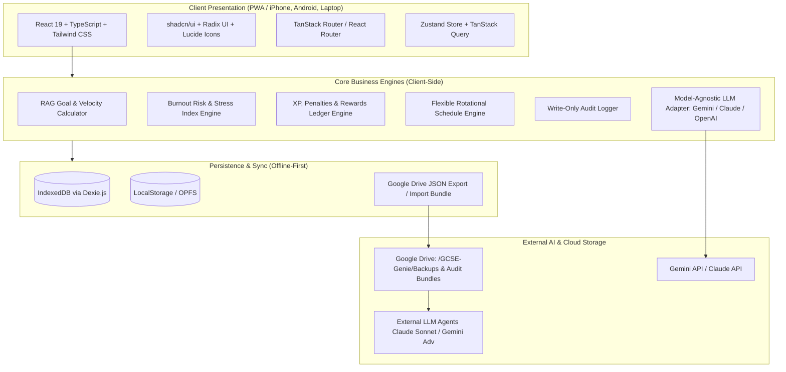
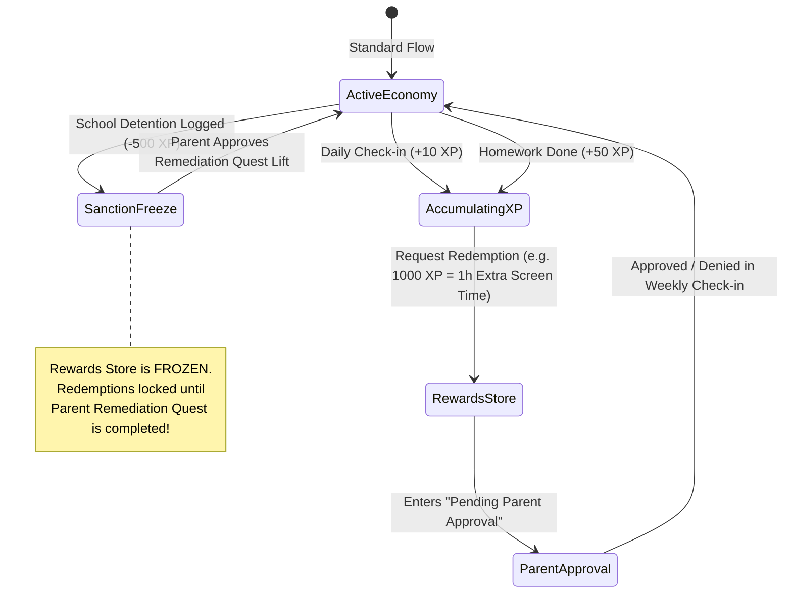

# GCSE Genie: Master Architecture Specification & Technical Blueprint (v1.1)
**Tailored for Tejas Dilip (GCSE Year 10, Guildford County School)**  
**Target Milestone: GCSE Grade 9 Excellence across all subjects**  
**Cross-Platform Parity: iPhone (Student) | Android (Parents) | Laptop (Desktop PWA)**

---

## 1. Executive Summary & System Philosophy

**GCSE Genie** is a private, offline-first, zero-administrative-overhead academic organiser and performance acceleration platform. It is engineered specifically for Tejas Dilip as he embarks on his two-year GCSE journey (Years 10–11) at Guildford County School (GCS), targeting **Grade 9s** across all six core and elective subjects.

```
+--------------------------------------------------------------------------------------------------+
|                                           GCSE GENIE                                             |
|                                                                                                  |
|  +-----------------------------------+    +---------------------------------------------------+  |
|  |       STUDENT PORTAL (iPhone)     |    |              PARENT PORTAL (Android / PC)         |  |
|  |  * <2-Min Daily Fast Check-in     |    |  * Secure PIN-Protected Mode Switch / Auth        |  |
|  |  * Grade 9 Goal RAG Visualizer    |    |  * Reward Redemption Approval Ledger              |  |
|  |  * Configurable 08:30 Timetable   |    |  * Schedule Overrides & Sanction Logger           |  |
|  |  * Remediation Quests (+XP)       |    |  * Model-Agnostic Agentic Audit (Gemini / Claude) |  |
|  |  * Career & Guidance Hub          |    |  * Change History Viewer (per-entry hash)            |  |
|  +-----------------+-----------------+    +-------------------------+-------------------------+  |
|                    |                                                |                            |
|  +-----------------v------------------------------------------------v-------------------------+  |
|  |                                  CORE APPLICATION ENGINES                                  |  |
|  |  [Burnout Heatmap / 60h Limit] [MoSCoW Prioritization] [XP Economy] [RAG Metric Calculator] |  |
|  +---------------------------------------------+----------------------------------------------+  |
|                                                |                                                 |
|  +---------------------------------------------v----------------------------------------------+  |
|  |                       OFFLINE-FIRST DATA & GOOGLE DRIVE SYNC LAYER                         |  |
|  |         IndexedDB (Dexie.js) + JSON Backup/Restore via Google Drive + Model-Agnostic LLM   |  |
|  +--------------------------------------------------------------------------------------------+  |
+--------------------------------------------------------------------------------------------------+
```

---

## 2. Core Architectural Principles & Constraints

1. **100% Privacy & Zero-School Integration**:
   - Zero integration with external school platforms (Sparx, Bromcom, MCAS, Microsoft Teams).
   - All data is managed locally and entered manually by Tejas or his parents.
   - Absolute data isolation; no external telemetry or teacher access.

2. **Ultra-Low Friction (<2 Minute Daily Overhead)**:
   - One-tap check-in buttons, preset sliders, and rapid homework check-offs.
   - Automated timetable population (Odd/Even GCS rotational calendar with 08:30 start).
   - Context-aware defaults to eliminate repetitive typing.

3. **Cross-Platform Device Parity (iPhone + Android + Laptop)**:
   - **Tejas's Device (iPhone / iOS Safari PWA)**: Safe-area insets (`env(safe-area-inset-*)`), iOS standalone display mode, touch target sizes $\ge 44\text{px}$, WebKit IndexedDB persistence.
   - **Parent Devices (Android Chrome PWA)**: Modern Material/Tailwind responsive UI, Android Google Drive file picker integration, install prompt banner.
   - **Laptops (PC / Mac Chrome / Edge)**: Multi-column responsive layout, drag-and-drop schedule builders, detailed RAG drill-down dashboards.
   - **Sync Strategy (Option A)**: One-click export/import of timestamped, encrypted JSON backup archives to Google Drive (`/GCSE-Genie/backups/`).

4. **Model-Agnostic Agentic Audit & Google Drive Path Integration**:
   - Supports **Google Gemini** (Gemini 1.5 Pro / Flash) and **Anthropic Claude** (Claude 3.5 Sonnet / Opus) as well as OpenAI.
   - **In-App Execution**: Direct API call using parent's stored key.
   - **External Drive-Based Execution**: One-click "Export Agent Audit Bundle" to the designated Google Drive path containing:
     * `audit_manifest.json`
     * `activity_logs_14d.json`
     * `time_budget_matrix.json`
     * `remediation_status.json`
     * `agent_instructions_prompt.md` (Ready for any external LLM terminal or web interface to evaluate).

5. **Tamper-Evident Immutable Audit Trail**:
   - Every state mutation (task creation, score update, XP award, sanction log) automatically writes to an append-only audit ledger with cryptographic hash chaining.

---

## 3. Technology Stack & System Architecture



| Layer | Recommended Technology | Justification |
| :--- | :--- | :--- |
| **Frontend Framework** | **React 19 + TypeScript + Vite** | Fast, type-safe, component-driven, high performance on mobile & desktop |
| **Styling & UI Kit** | **Tailwind CSS + shadcn/ui + Lucide Icons** | Clean, modern, accessible design with dark/light mode and mobile touch targets |
| **State Management** | **Zustand** | Lightweight, boilerplate-free state store with local persistence middleware |
| **Local Data Store** | **IndexedDB via Dexie.js** | Robust client-side database with reactive queries, schema migrations, and high capacity |
| **Data Sync / Backup** | **Google Drive JSON Bundle (Option A)** | True offline-first capability with zero vendor lock-in; seamless cross-device portability |
| **PWA & Offline** | **Vite PWA Plugin (Workbox)** | Full offline asset caching, app-like standalone installation on iOS/Android/PC/Mac |
| **Charts & Visuals** | **Recharts + Lucide** | RAG gauges, time-capacity heatmaps, XP progression bars, and diagnostic radar charts |
| **Model-Agnostic AI Adapter** | **Gemini / Claude / OpenAI REST SDK** | Pluggable architecture supporting multiple LLM providers for in-app or file-based audits |

---

## 4. Subsystem & Module Breakdown

### 4.1. Module 1: Student Daily Dashboard & Rapid Check-in (<2 min)

The dashboard is ordered by **daily frequency of use**, not by conceptual importance:

1. **"What's next" card** — overdue work first, then due today, then the next seven days, with
   upcoming key dates counting down beneath. Tasks are tickable in place. This answers the question
   the app is opened to answer and therefore sits above everything else.
2. **"Log today" banner** — opens the check-in.
3. **Today's schedule + active quests** — contextual, side by side.
4. **Weekly time capacity gauge** — a status readout, not a daily action, so it sits last.

- **Quick-Toggle Check-in**: energy (1–5), focus, tap-to-complete homework list, study-time slider,
  and three structured log questions. Multiple sessions per day (Morning / Afternoon / Study /
  Evening); the daily base XP is awarded only on the first.
- **Quick Add**: a floating action button present on *every* screen opens a single sheet that adds
  either a homework task or a key date. Three required fields; priority, category and notes are
  collapsed behind *More options*. Adding is the second most frequent action after checking in, so
  it deliberately does not live inside a particular tab.
- **Active Quests Strip**: Shows pending Year 9 remediation actions with live XP rewards.
- **Real-Time Streak Engine**: Streak and XP in the header; confetti on completion. (Haptics are
  specified but not yet implemented.)

> **Navigation tiers.** Sections are split into `daily` (Home, My Work, Key Dates, Fix My Mistakes)
> and `weekly` (Rewards, Timetable, Subjects & Goals, Careers & Help, Parent Portal). On mobile the
> daily four form the bottom bar and the rest sit behind a **More** sheet; on desktop a `WEEKLY`
> divider separates them. Goal creation and amendment is explicitly a weekly-tier activity.
> The XP badge in the header doubles as a shortcut into the Rewards shop so that spending XP stays
> one tap away without consuming a navigation slot.

---

### 4.2. Module 2: Grade 9 Academic Curriculum & RAG Goal Hierarchy

Hardcodes the exact exam boards and structures for Tejas's subjects:

```mermaid
graph TD
    Target[Ultimate Goal: Straight Grade 9s across all 6 GCSEs]
    
    Target --> M[Edexcel Maths (Linear 9-1)]
    Target --> E[AQA English Lang & Lit]
    Target --> S[AQA Separate Science (Bio, Chem, Phys)]
    Target --> H[AQA History]
    Target --> CS[OCR Computer Science]
    Target --> A[AQA Art, Craft & Design]
    
    M --> M1[3x 1.5h Written Papers]
    S --> S1[6x 1h45m Papers + 21 Required Practicals]
    H --> H1[America / Conflict & Tension / Health / Normans]
    CS --> CS1[Comp 1 Systems + Comp 2 Algorithms + Improvement Log]
    A --> A1[60% Portfolio + 40% Externally Set 10h Exam]
    
    M1 --> TasksM[Curriculum Topics & Remediation Actions]
    S1 --> TasksS[Practicals & Unit Conversions]
    CS1 --> TasksCS[Homework Streak & Programming Logic]
```

#### RAG Status Health Metric Formula

**As implemented** (`src/services/ragCalculator.ts`):
$$\text{Health}(S) = 0.40 \times \text{HW\_Rate}(S) + 0.35 \times \text{Remediation\_Rate}(S) + 0.25 \times \text{Topic\_Mastery}(S)$$
- **Green (On Track for Grade 9)**: $\text{Health} \ge 85\%$
- **Amber (Needs Attention / Intervention)**: $65\% \le \text{Health} < 85\%$
- **Red (Critical Risk to Grade 9 Target)**: $\text{Health} < 65\%$

A per-subject manual override (`manualRAGOverride`, `manualHealthScore`) can force a status when the
calculated value is misleading.

> **Divergence from the original design — and two weaknesses to fix.**
> The originally specified formula included an `Assessment_Avg` term weighted at 35%. **No assessment
> results are recorded anywhere in the app**, so that term does not exist and its weight has been
> redistributed. Consequences worth understanding before trusting a green light:
>
> 1. **The score measures effort, not attainment.** Nothing in it reflects a real, externally marked
>    result. `currentEstimatedGrade` is seeded once and never updated by anything.
> 2. **Doing nothing scores better than doing something imperfectly.** Homework completion counts only
>    tasks that exist in the app, and defaults to 100% when a subject has none — so a subject with no
>    logged work looks perfect. Topic mastery is entirely self-declared (clicking five stars sets
>    `isCompleted`). Overdue work is not represented at all.
>
> Adding an assessment-results log and making it the primary input is the highest-value change
> available to this module.

**Interactive Dashboard Drilldown**:
Clicking any subject card reveals:
1. Topic-by-topic syllabus mastery checklist.
2. Required practicals / coursework progress bar (21 AQA Practicals, OCR CS Improvement Log).
3. Diagnostic history with exam paper attachments.
4. Linked teacher notes and homework logs.

---

### 4.3. Module 3: Flexible 08:30 Timetable & Organiser Hub

The timetable starts at **08:30** by default, with Guildford County School's bi-weekly (Odd/Even) rotational templates and 100% configurable time slots:

#### Default GCS Daily Period Template (Configurable)
| Period / Block | Default Time Slot | Configurable Properties |
| :--- | :--- | :--- |
| **Registration / Tutor** | **08:30 – 08:50** | Start/End time, Room, Tutor name |
| **Period 1** | **08:50 – 09:50** | Subject, Room, Teacher, Homework flag |
| **Period 2** | **09:50 – 10:50** | Subject, Room, Teacher, Homework flag |
| **Morning Break** | **10:50 – 11:10** | Duration, Rest status |
| **Period 3** | **11:10 – 12:10** | Subject, Room, Teacher, Homework flag |
| **Period 4** | **12:10 – 13:10** | Subject, Room, Teacher, Homework flag |
| **Lunch Break** | **13:10 – 13:55** | Duration, Co-curricular clubs |
| **Period 5** | **13:55 – 14:55** | Subject, Room, Teacher, Homework flag |
| **After-School / Free** | **14:55 – 19:00** | Study block, DofE, Art class, Drums |
| **Cadets / Evening** | **19:00 – 22:00** | Tue & Fri strictly blocked (Air Cadets) |

**Rotational Calendar Presets**:
- **Odd Week**: Mon (Maths/Languages), Tue (Science/Music), Wed (English/Geography), Thu (Maths/History), Fri (Science/Art).
- **Even Week**: Mon (English/Languages), Tue (Maths/Computing), Wed (Science/Geography), Thu (English/History), Fri (Drama/PRE/DT).
- **Extracurricular Blocks**:
  - **Air Cadets**: Tue & Fri 19:00 – 22:00 (6.0 hrs/week, hard-locked).
  - **GCSE Support Art Class**: Weekly set block (1.5 hrs/week).
  - **Drum Lessons & Practice**: Rotational weekly slot (2.0 hrs/week).
  - **Bronze DofE**: Volunteering / Physical / Skills / Expedition milestones (2.0 hrs/week).

---

### 4.4. Module 4: Real-World Assessment & Remediation Action Portal

Directly digitizes Year 9 baseline exam diagnostic errors and turns them into high-XP active quests:

| Subject | Diagnostic Source | Specific Deficit Identified | High-Value Remediation Quest | Reward |
| :--- | :--- | :--- | :--- | :--- |
| **Mathematics** | `yr9- maths.pdf` (60/75) | Failed independence proof ($0/2$) | Complete 3 proofs using $P(B \cap S) = P(B) \times P(S)$ | **+200 XP** |
| **Mathematics** | `yr9- maths.pdf` | Coordinate center enlargement error ($1/2$) | 2 shape enlargements with negative fractional scale factors | **+150 XP** |
| **Mathematics** | `yr9- maths.pdf` | Expanding $(2x+3)^2 - (2x+3)(x-5)$ signs | Solve 5 quadratic expansions with negative distribution | **+100 XP** |
| **Science** | `science .pdf` | Inverted Rf calculation ($\text{Rf} = 5.6 > 1.0$) | 5 Rf problems with strict validation rule ($\text{Rf} < 1.0$) | **+150 XP** |
| **Science** | `science .pdf` | Multiplied $65\text{W} \times 25\text{m}$ (omitted sec conversion) | 5 energy calculations with mandatory "Unit Safety Check" | **+200 XP** |
| **History** | `history.pdf` (20.5/28) | Weimar "Reparations" definition deficit | Match 5 terms (Reparations, Diktat, Demilitarisation, etc.) | **+100 XP** |
| **History** | `history.pdf` | Missing comparison in 12-mark Versailles essay | Structure a 3-paragraph comparative skeleton with judgment | **+250 XP** |
| **Computer Science** | `ir report.pdf` (IR3) | Homework "Below expected standard" (AMN) | 14-day streak logging and submitting CS homework on time | **+300 XP** |

---

### 4.5. Module 5: Time-Budget Matrix & Burnout Risk Heatmap

- **Safe Weekly Working Threshold**: **60.0 hours/week**. This is a *total* and includes school
  hours, so it is not a homework budget.
- **Fixed Baseline Commitments** (declared once in `BASELINE_COMMITMENTS`):
  - GCS School Hours: **32.5 hrs**
  - Air Cadets (Tue/Fri 19:00–22:00): **6.0 hrs**
  - GCSE Support Art Class: **1.5 hrs**
  - Drum Lessons & Practice: **2.0 hrs**
  - Bronze DofE (Skills/Volunteering/Physical): **2.0 hrs**
  - **Base Load Total**: **44.0 hrs/week** (Study headroom remaining: **16.0 hrs**).

- **Stress Index Formula**:
  $$\text{Stress Index} = \frac{\text{Baseline} + \text{Approved Goals} + \text{Logged Study}}{60.0\text{ hrs}} \times 100\% + \text{Task Pressure Surcharge}$$
  where the surcharge is $2\%$ per overdue task plus $1.5\%$ per high-priority task beyond the second.
  - **Green**: $< 90\%$ (up to ~10 hrs/week of study)
  - **Amber**: $90\% - 100\%$ (~10–16 hrs/week)
  - **Red Alert (Burnout Hazard)**: $> 100\%$ (more than ~16 hrs/week)

> **Revision note — the 45h ceiling was raised to 60h.** With a 44h baseline, a 45h ceiling left
> under one hour a week for all homework and revision. The gauge therefore read CRITICAL on first
> launch and never moved, regardless of behaviour, which is textbook alert fatigue. A second defect
> compounded it: Air Cadets was counted twice (once as a hardcoded baseline constant, once as the
> seeded `g-cadets` approved goal), making the true starting figure 50h against a 45h limit — 111%.
> Baseline commitments now carry an optional `coveredByGoalId` so a goal representing the same
> real-world commitment is excluded from the goals total. The ceiling is a single named constant,
> `SAFE_WEEKLY_HOURS_LIMIT` in `src/services/burnoutEngine.ts`, and is intended to be tuned.
>
> Note also that **logged study time counts toward the total**. This is deliberate — it is real time —
> but it means the ceiling must leave genuine study headroom, or studying more would push the student
> toward a burnout warning, which inverts the incentive the module exists to create.

- **MoSCoW Dynamic Override**:
  During mock exams or major Art practical deadlines, the app automatically recommends postponing `COULD_HAVE` co-curricular goals to maintain safe rest margins.

---

### 4.6. Module 6: Gamification, Sanctions & Real-World Rewards Ledger



---

### 4.7. Module 7: General Help, Teacher Directory & Post-GCSE Career Hub

1. **Teacher Directory & Communication Notes**:
   - Contact cards for all GCS teachers (e.g., AMN for Computer Science).
   - Private student notes section (e.g., "Ask Mr. X about Question 4 on Tuesday lunch").
2. **Curated High-Value Revision Links & Mock Exams**:
   - **Maths**: CorbettMaths 5-a-day, MathsGenie, Physics & Maths Tutor (PMT).
   - **Science**: FreeScienceLessons, Isaac Physics, PMT 21 Required Practicals Guides.
   - **Computer Science**: CSNewbs, Craig'n'Dave OCR J277 videos, Isaac Computer Science.
   - **History**: Seneca Learning AQA, BBC Bitesize Weimar & Versailles.
   - **English**: Mr Bruff, SparkNotes, Massolit analytical essay models.
3. **Post-GCSE Pathway & Career Insights Module**:
   - Connects Grade 9 achievement to future paths:
     - **Path 1: A-Levels (Maths, Further Maths, Physics, CS) -> Top Engineering / CS Degree / Oxbridge / Imperial / Russell Group**.
     - **Path 2: Degree Apprenticeship in Aerospace / Defense (Air Cadets link) / Software Engineering**.
   - Actionable career insight tasks embedded into the weekly quest queue (e.g., "Explore Aerospace Engineering prerequisites: requires Grade 8/9 in Maths & Physics").

---

### 4.8. Module 8: Parent Portal & Model-Agnostic "Agentic Audit"

Accessible via a secure 4-digit Parent PIN:
1. **Model-Agnostic LLM Provider Interface**:
   - Choose provider: **Google Gemini (Default)**, **Anthropic Claude**, **OpenAI**, or **Custom/Local Endpoint**.
   - Enter API Key securely in local device storage.
2. **Dual Execution Workflows**:
   - **Workflow A: In-App Direct Audit**:
     Click "Run Agentic Audit" -> App evaluates the 14-day telemetry and renders the Plan Alignment Report in seconds.
   - **Workflow B: Google Drive Path Export (For External Agents)**:
     Click "Export Audit Bundle to Google Drive" -> Generates a clean JSON + Markdown bundle at the specified Google Drive folder path, allowing you to run external audits via Claude 3.5 Sonnet web/desktop or Gemini Advanced.
3. **Plan Alignment Report Sections**:
   - **Curriculum Health Matrix**: RAG breakdown per subject.
   - **Burnout & Stress Analysis**: Capacity and sleep integrity evaluation.
   - **Subject Balance Alerts**: Highlights neglected homework or revision deficits (e.g. Computer Science).
   - **Actionable Adjustments**: Concrete calendar & habit recommendations.
4. **Change History Viewer** (labelled "Change History" in the UI - see 8.3; it is NOT immutable or hash-chained):
   - Displays all historical events: `[Timestamp | User | Field | Action | Old Value | New Value]`.

---

## 5. Comprehensive Database Schema (IndexedDB / Dexie.js)

```typescript
// ============================================================================
// GCSE GENIE: CORE DATABASE SCHEMA SPECIFICATION
// ============================================================================

export type SubjectId = 'maths' | 'english_lang' | 'english_lit' | 'biology' | 'chemistry' | 'physics' | 'history' | 'computer_science' | 'art';
export type UserRole = 'STUDENT' | 'PARENT' | 'SYSTEM_AGENT';
export type RAGStatus = 'RED' | 'AMBER' | 'GREEN';
export type GoalStatus = 'DRAFT' | 'PENDING_DISCUSSION' | 'APPROVED_LOCKED' | 'COMPLETED' | 'DEFERRED';
export type LLMProvider = 'GEMINI' | 'CLAUDE' | 'OPENAI' | 'LOCAL';

export interface SubjectConfig {
  id: SubjectId;
  name: string;
  examBoard: 'Edexcel' | 'AQA' | 'OCR';
  targetGrade: 9;
  teacherName: string;
  teacherEmail?: string;
  notes?: string;
}

export interface DailyCheckIn {
  id: string; // ISO Date: YYYY-MM-DD
  date: string;
  timestamp: number;
  energyLevel: 1 | 2 | 3 | 4 | 5;
  focusRating: 'LOW' | 'NORMAL' | 'HIGH';
  completedHomeworkIds: string[];
  completedRevisionMinutes: number;
  notes?: string;
  xpEarned: number;
}

export interface Task {
  id: string;
  subjectId: SubjectId;
  title: string;
  description?: string;
  dueDate: string;
  isHomework: boolean;
  isRemediation: boolean;
  remediationSourceDoc?: string; // e.g. "yr9- maths.pdf"
  xpValue: number;
  completed: boolean;
  completedAt?: number;
  createdAt: number;
}

export interface Goal {
  id: string;
  title: string;
  category: 'ACADEMIC_GRADE_9' | 'CO_CURRICULAR' | 'PERSONAL';
  subjectId?: SubjectId;
  smartSpecific: string;
  smartMeasurable: string;
  smartAchievable: string;
  smartRealistic: string;
  smartTimeBound: string;
  status: GoalStatus;
  ragStatus: RAGStatus;
  weeklyHoursRequired: number;
  parentNotes?: string;
  lockedAt?: number;
  createdAt: number;
}

export interface TimetableSlotConfig {
  id: string;
  name: string; // e.g. "Registration", "Period 1", "Break"
  defaultStartTime: string; // "08:30"
  defaultEndTime: string; // "08:50"
  isBreakOrLunch: boolean;
}

export interface TimetableEntry {
  id: string;
  weekType: 'ODD' | 'EVEN' | 'BOTH';
  dayOfWeek: 'MON' | 'TUE' | 'WED' | 'THU' | 'FRI' | 'SAT' | 'SUN';
  slotId: string;
  startTime: string; // "08:30"
  endTime: string; // "08:50"
  subjectId?: SubjectId;
  activityName: string;
  location?: string;
  isHardLocked: boolean;
}

export interface RewardItem {
  id: string;
  title: string;
  description: string;
  costXP: number;
  icon: string;
}

export interface RewardRedemption {
  id: string;
  rewardId: string;
  rewardTitle: string;
  costXP: number;
  requestedAt: number;
  status: 'PENDING' | 'APPROVED' | 'DENIED';
  resolvedAt?: number;
  parentComments?: string;
}

export interface Sanction {
  id: string;
  type: 'DETENTION' | 'HOMEWORK_SANCTION' | 'CUSTOM';
  reason: string;
  date: string;
  penaltyXP: number;
  shopFrozen: boolean;
  remediationTaskIdRequired?: string;
  resolvedAt?: number;
  loggedBy: 'PARENT';
}

export interface AuditLogEntry {
  id: string;
  timestamp: number;
  user: UserRole;
  action: 'INSERT' | 'UPDATE' | 'DELETE' | 'AGENT_AUDIT' | 'SANCTION_FREEZE';
  entity: string;
  entityId: string;
  fieldChanged?: string;
  oldValue?: string;
  newValue?: string;
  hash: string;
}

export interface ParentSettings {
  parentPinHash: string;
  googleDriveBackupPath: string; // e.g. "G:/My Drive/Documents/UK/Family/Tejas/GCSE-Genie/Backups"
  llmProvider: LLMProvider;
  llmApiKey?: string;
  llmModelName?: string; // e.g. "gemini-1.5-pro" or "claude-3-5-sonnet-20241022"
}

export interface AgentAuditReport {
  id: string;
  timestamp: number;
  generatedBy: string; // e.g. "Gemini-1.5-Pro" or "Claude-3.5-Sonnet"
  curriculumStatusSummary: string;
  burnoutStressIndexScore: number;
  burnoutStatus: RAGStatus;
  subjectBalanceAlerts: string[];
  actionableRecommendations: string[];
  rawMarkdown: string;
}

export interface CareerGuidanceResource {
  id: string;
  title: string;
  category: 'A_LEVELS' | 'UNIVERSITY_DEGREE' | 'DEGREE_APPRENTICESHIP' | 'CAREER_INSIGHT';
  requiredGCSEGrade: number;
  relevantSubjectIds: SubjectId[];
  description: string;
  externalUrl?: string;
}
```

---

## 6. Multi-Platform User Experience & Design Guidelines

### 6.1. iPhone (Student Experience - Tejas)
- **Home Screen Installation**: Add to Home Screen via Safari, runs full-screen without URL bars.
- **Haptics & Touch Targets**: Generous 48px+ touch targets, instant feedback on habit completion.
- **Quick Logging**: 3-step check-in modal with slider controls and tap-to-complete cards.
- **Safe Area Padding**: CSS padding handles dynamic island, notch, and home bar seamlessly.

### 6.2. Android (Parent Experience - Dilip/Mom)
- **Home Screen Installation**: Installable via Chrome PWA prompt.
- **Quick PIN Access**: 4-digit numeric keypad for rapid entry into Parent Portal.
- **Rewards Approval Queue**: Swipe right to approve, swipe left to deny point redemption requests.
- **Drive Backup Sync**: Direct file download/save to Google Drive app.

### 6.3. Laptop / Desktop (Planning & In-Depth Review)
- **Multi-Column Layout**: Dashboard splits into Schedule, Goals RAG, and Quests simultaneously.
- **Visual Timetable Builder**: Drag-and-drop period assignments and customizable Odd/Even grids.
- **Comprehensive Audit View**: Full audit ledger table with searchable filters.

---

## 7. Implementation Roadmap

1. **Phase 1: Core PWA Scaffolding & Offline Data Engine**
   - React 19 + TypeScript + Vite + Tailwind CSS + shadcn/ui.
   - Dexie.js (IndexedDB) database initialized with sample Year 9 data and GCS defaults.
   - Google Drive JSON Export/Import Backup service.
   - Append-only write-only audit logger.
2. **Phase 2: Student Dashboard & Remediation Hub (iPhone & Laptop)**
   - Rapid <2 minute daily check-in UI.
   - Flexible 08:30 rotational Odd/Even Guildford County School timetable.
   - Year 9 real-world remediation quests with XP reward engine.
3. **Phase 3: Grade 9 Goal Engine, Burnout Matrix & Career Hub**
   - Grade 9 RAG visualizer and topic-level drill-down.
   - 60h weekly capacity tracker with stress index heatmap.
   - Teacher directory, curated revision links, and post-GCSE career pathways.
4. **Phase 4: Parent Portal & Model-Agnostic Agentic Audit (Android & Laptop)**
   - Secure PIN authentication and rewards ledger approval workflow.
   - Model-agnostic AI Audit engine (Gemini & Claude adapter) + Google Drive audit bundle exporter.
   - End-to-end testing across iOS Safari, Android Chrome, and Desktop.

---

## 8. Implementation Status vs. Specification

This section records where the running application diverges from the design above, so that gaps are
not rediscovered as bugs. Last reviewed: **August 2026**.

### 8.1. Built and working

| Module | Status |
| :--- | :--- |
| Daily check-in & structured learning log | ✅ Multiple sessions/day, XP banked once |
| "What's next" dashboard card | ✅ Overdue → today → next 7 days, tick in place |
| Quick Add (homework / key date) | ✅ Floating action button on every screen |
| Frequency-tiered navigation | ✅ Daily vs weekly tiers, mobile "More" sheet |
| Diagnostic quests + mark schemes | ✅ Score, proof URL, working notes, sub-quests |
| Subject RAG matrix | ⚠️ Works, but see 4.2 — measures effort, not attainment |
| Weekly time-capacity gauge | ✅ Recalibrated, see 4.5 |
| XP, rewards shop, sanctions | ⚠️ Works, but see 8.2 |
| Parent PIN + Parent Portal | ✅ Hash-checked, changeable, default flagged |
| JSON backup / restore | ⚠️ Works, but destructive and unconfirmed on restore |
| Offline agentic audit engine | ✅ Deterministic rules engine |

### 8.2. Specified but not implemented

1. **Goal approval / locking.** `GoalStatus` defines `PENDING_DISCUSSION → APPROVED_LOCKED`, and the
   burnout engine only counts `APPROVED_LOCKED` goals — but **no code path anywhere performs that
   transition**. Proposed goals are inert: they never affect the time budget, and cannot be completed,
   deferred, edited or deleted. The central parent toll gate in the design does not exist.
2. **Assessment results.** No storage for mock or interim-report scores. See 4.2.
3. **Overdue escalation.** Overdue tasks tint red and add a small stress surcharge. They do not
   downgrade RAG status, notify anyone, or gate the rewards shop.
4. **PWA install / offline.** No `manifest.json` and no service worker, despite the iOS/Android
   install instructions. Chrome will not offer "Install app" and nothing works offline.
5. **Cross-device sync.** IndexedDB is per-device. Parent approval, sanctions and audits therefore
   only function on the student's own device. This is the single largest architectural constraint on
   the parent-oversight half of the design.
6. **Contextual schedule banner** (current-period detection with countdown), **haptics**, **swipe to
   approve/deny**, **drag-and-drop timetable builder**, and **searchable audit filters** are all
   specified in §4.1 and §6 but not built.
7. **Sleep logging** — §4.1 lists it in the check-in; only energy and focus are captured.

### 8.3. Implemented differently than specified

| Area | Specified | Actual |
| :--- | :--- | :--- |
| Safe weekly ceiling | 45.0 h | 60.0 h — see 4.5 |
| RAG weighting | 35/35/20/10 incl. assessments | 40/35/25, no assessment term |
| Verification of quests | — | Self-marked; no parent verification flag |
| Audit ledger | "Cryptographically chained" | Per-entry SHA-256 only; **no chain**, and rows are deletable |

### 8.4. Known defects in dependencies of the design

- **Live LLM audits never reach the provider.** The Anthropic call sends a non-existent browser
  header (`dangerously-allow-browser`; the real one is `anthropic-dangerous-direct-browser-access`),
  and both default model IDs — `claude-3-5-sonnet-20241022` and `gemini-1.5-pro` — are retired or
  superseded. OpenAI is selectable but unimplemented. All failures are swallowed and the offline
  engine runs instead, with no indication to the parent that their API key was never used.
- **The Markdown half of the audit bundle is discarded.** `generateAgentAuditPackage()` returns both
  `jsonContent` and `markdownSummary`; only the JSON is downloaded, so the "Instructions for
  Reviewing Agent" prompt never reaches the user.
- **Seed timetable is incomplete.** Only Monday of the Odd week has lessons; the Even week is empty.

### 8.5. Naming — nav label and page heading must match

The app is used daily by a 14 year old, so section names are written in plain English. **The page
banner must repeat the navigation label verbatim.** An earlier pass renamed the tabs but not the
pages behind them, so tapping *Fix My Mistakes* landed on a page headed "Year 9 Assessment
Diagnostic Remediation Portal" — which defeats the point of the rename.

| Tab | Nav label | Page banner | Old name |
| :--- | :--- | :--- | :--- |
| `DASHBOARD` | Home | *(dashboard cards)* | Dashboard |
| `TASKS` | My Work | My Work | Workload Prioritization & Homework Planning |
| `CALENDAR` | Key Dates | Key Dates | Academic Milestones, Mocks & Reminders Calendar |
| `REMEDIATIONS` | Fix My Mistakes | Fix My Mistakes | Year 9 Assessment Diagnostic Remediation Portal |
| `REWARDS` | Rewards | Rewards | Parent-Managed Rewards Ledger |
| `TIMETABLE` | Timetable | Timetable | Guildford County School Rotational Timetable |
| `GOALS` | Subjects & Goals | Subjects & Goals | GCSE Grade 9 Target Hierarchy |
| `GUIDANCE` | Careers & Help | Careers & Help | General Guidance, Free Revision Links & Career Pathways |
| `PARENT` | Parent Portal | Parent Portal | Parent Portal & Agentic Governance |

Detail that carries real information (exam boards, the Odd/Even rotation, what a section is for)
moved into the subtitle rather than being deleted. Sub-headings follow the same rule: "What you can
spend XP on" rather than "Real-World Reward Catalog", "Topics covered" rather than "Year 10 Syllabus
Mastery Checklist".

### 8.6. Platform traps

- **IndexedDB cannot index booleans.** `completed`, `isCompleted`, `isHomework` and `shopFrozen`
  appear in Dexie schema strings but are never indexed. `.where('completed').equals(0)` silently
  returns `[]`. Filter booleans in memory.
- **`toISOString()` is UTC.** During British Summer Time, "today" computed this way is wrong between
  00:00 and 01:00 local — a check-in at 00:30 files against yesterday and breaks the streak. All date
  handling goes through `src/utils/date.ts`.
