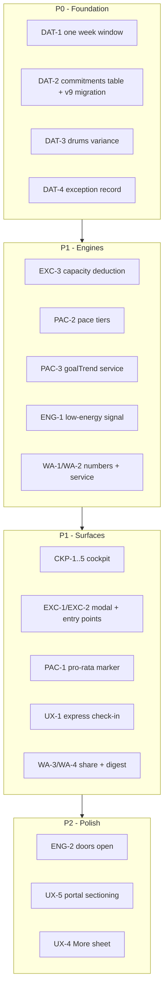

# GCSE Genie — Consolidated Enhancement Spec

Status: draft for build · Date: 2026-08-28 · Baseline: `main` @ 49b9336

This spec reconciles three inputs:

1. The 5-Pillar enhancement blueprint (cockpit, pacing charts, attendance exceptions, WhatsApp, UX).
2. The launch film treatment (`docs/launch-film.md`) — every promise Act 3 makes on screen.
3. What is actually in the codebase today.

It supersedes the blueprint where the blueprint is wrong about the current state. Those
corrections are listed first, because roughly a third of the proposed work is already built and
building it again would produce a second, disagreeing copy.

---

## Part 1 — Corrections to the blueprint

The blueprint was written against an assumed codebase. These items are already shipped, and the
requirement is to *finish* or *surface* them, not to build them.

| Blueprint claim | Actual state | What the requirement becomes |
| :--- | :--- | :--- |
| "A locked goal reserves hours but there was no visual breakdown showing whether those hours are actually being worked" | **Built.** `services/goalProgress.ts` computes `actualHours`, `targetHours`, `proRatedTargetHours` (`target × weekday / 7`), `percentOfWeek` and `needsAction`, gated to Wednesday+ via `EARLIEST_NUDGE_WEEKDAY = 3`. Rendered in `Grade9GoalsView` (bar + "Needs action — Xh expected by today"), `WeeklyReviewModal` and `PlanPulseBanner`. | Add the *pro-rata marker on the bar*, the third (rose) tier, and the 4-week trend. Do not rewrite the engine. |
| "Study time goes into a single global bucket" | **Fixed already.** `DailyCheckIn.studySubjectId` and `studyGoalId` exist, and the check-in modal defaults the subject from the homework being ticked. | No work. |
| Quick Add "multi-step form", needs "defaults date to tomorrow, priority to Normal" | **Already there.** `QuickAddSheet` opens with `dueDate = addDaysISO(1)` and `priority = 'MEDIUM'`, plus Tomorrow / In 3 days quick chips. | Only the timetable-aware subject default is missing. |
| Parent settings are "dispersed across panels" | **Already one page.** `ParentPortal` renders StudentProfile → Chores → Rewards → Guidance → Data → Handover → passphrase → audit in a single scroll. | The problem is a 948-line unsectioned scroll, not dispersion. Requirement is sectioning, not consolidation. |
| Daily check-in is a "3-step modal" | It is a **single 699-line form** with no step state: energy, focus, homework checkboxes, minutes, subject, goal, three textareas, two more subject pickers, two auto-task toggles. | The express-mode requirement stands and is if anything understated. |
| Mobile bottom bar "has 10 tabs" | The bar already has **4 daily tabs + More**; 11 tabs exist in total, tiered `daily` / `weekly` in `Navigation.tsx`. | See UX-4 — and note the disagreement recorded there. |

### One recommendation against the blueprint

The blueprint's proposed 4-tab bar is **Today · Plan · Proof Log · More**. That demotes
**Fix My Mistakes** (`REMEDIATIONS`) out of the bar and promotes **Proof Log**, which the codebase
itself classifies as `tier: 'weekly'` ("logged when a marked paper comes back").

Fix My Mistakes is the app's answer to the film's central Act 1 thesis — *"the knowledge gap
doesn't open up suddenly, it drifts"* (Scene 05). Burying the one screen that closes a known gap,
in order to promote a screen used once a week, works against the film. **Recommendation: keep the
current daily four (Home · Work · Plan · Fix Ups) and spend the simplification effort on the Home
screen instead**, which is where the actual sprawl is. UX-4 is written that way; override it
explicitly if you disagree.

---

## Part 2 — Gaps the blueprint misses

Assessed against the film, four promises made on screen have no implementation at all. Three of
them are cheap.

**G1 · "Summer 2027" is never said in the app.** Scene 01 opens on it and the title card is the
spine of the whole film. The app has `formatCountdown()`, and seed goals carry
`targetDate: '2027-06-15'` — but nothing anywhere renders days-to-exams. There is no exam date in
`ParentSettings`. The film's first frame promises a countdown the product does not have.

**G2 · The empty tank has no path.** Scenes 11.1 and 20 — *"there will be days when the tank is
completely empty"*, *"asking us for support when it gets too heavy"*. `DailyCheckIn.energyLevel`
(1–5) and `focusRating` are captured on every check-in, displayed back in the history modal,
exported to CSV — and consumed by **nothing**. No engine reads them. A student can log energy 1
five days running and every screen stays green. This is the single largest gap between the film
and the app.

**G3 · Doors closing is not modelled.** Scene 06 — *"how many doors are still open"*, over
Further Maths · Physics · Computer Science. `careerResources` rows carry `requiredGCSEGrade` and
`relevantSubjectIds`, and `HelpAndCareersHub` lists them, but nothing joins that to each subject's
`currentEstimatedGrade`. The data to answer "which doors are still open at today's grades" is
already in the database, unjoined.

**G4 · There is no family-facing moment.** Scene 21.5 is the family celebrating together. Every
output today is a screen one person looks at alone. This is precisely the hole the WhatsApp pillar
fills, and it is a stronger justification for it than "communication".

---

## Part 3 — Data integrity defects found during review

These are pre-existing and must be resolved *before* the cockpit, because the cockpit puts these
numbers side by side, where any disagreement becomes visible.

**D1 · Two different definitions of "this week".** `burnoutEngine.calculateBurnoutCapacity()`
computes `loggedRevisionHours` from a **rolling 7 days**
(`db.checkIns.where('timestamp').aboveOrEqual(Date.now() - 7*86400000)`). `goalProgress` computes
its hours from **Monday week-start** (`startOfWeekISO()`). Today these numbers live on different
cards. In Zone A / Zone B of one cockpit they will visibly fail to reconcile — the sum of per-goal
hours will not equal "Revision Logged".

**D2 · Fixed commitments exist twice, unlinked, and already disagree.**
`burnoutEngine.BASELINE_COMMITMENTS` is a hardcoded 5-element `const`. The same commitments also
exist as `isHardLocked` rows in `timetableEntries`. Nothing joins them, and one already diverges:

| Commitment | BASELINE_COMMITMENTS | Timetable rows | Match |
| :--- | :--- | :--- | :--- |
| School | 32.5h | generated periods | n/a |
| Air Cadets | 6.0h | `cadets-tue` + `cadets-fri`, 19:00–22:00 ×2 = 6.0h | ✅ |
| Art Support | 1.5h | `art-support-wed` 15:15–16:45 = 1.5h | ✅ |
| Drums | 2.0h | `drums-thu` 16:00–17:00 = **1.0h** | ❌ |
| Bronze DofE | 2.0h | `dofe-sat` 10:00–12:00 = 2.0h | ✅ |

The Drums 2.0h is presumably a 1h lesson plus 1h home practice, but that is undocumented and
unrepresented. More importantly: **an absence cannot be logged against a `const`.** The exception
feature is blocked on making a commitment an addressable entity, which is the real content of
Pillar 3.

**D3 · Baseline commitments are not editable by anyone.** A second child, a dropped activity, or
simply quitting drums requires a source change. `ParentSettings` gained `studentName` /
`studentYearGroup` for exactly this reason; commitments never did.

---

## Part 4 — The requirements

Priority: **P0** blocks the rest · **P1** ships in the first enhancement release · **P2** follows.

### DAT — Data foundation (P0, blocks everything else)

**DAT-1 · One week window.** Extract a single shared helper (`services/weekWindow.ts`) exposing the
Monday-start week boundaries, and make `burnoutEngine`, `goalProgress`, `habitEngine`
(`hoursThisWeek`) and `planService` all use it. Where a rolling-7-day figure is genuinely wanted
(effort/streak framing), keep it but name it distinctly (`hoursLast7Days`) so the two can never be
confused in a UI.
*Accept:* the sum of per-goal weekly hours ≤ the cockpit's "Revision logged" figure, always, and
both reset on the same Monday boundary.

**DAT-2 · Commitments become data.** Add a `commitments` table.

```ts
interface FixedCommitment {
  id: string;                    // 'cadets' | 'drums' | 'dofe' | 'artSupport' | 'school' | custom
  label: string;                 // "Air Cadets"
  weeklyHours: number;
  isActive: boolean;
  /** Timetable rows this commitment is realised by, so an absence maps to an occasion. */
  timetableEntryIds: string[];
  /** An approved goal covering the same real hours — must not be double-counted. */
  coveredByGoalId?: string;
  createdAt: number;
  createdBy: UserRole;
}
```

Seeded from the current `BASELINE_COMMITMENTS` on upgrade (Dexie v9), preserving the exact present
values including Drums 2.0h, so no existing number moves on migration day. `burnoutEngine` reads
the table instead of the `const`. Editable in the Parent Portal (see UX-5).
*Accept:* deactivating a commitment in the portal changes the capacity total; no hardcoded hours
remain in `burnoutEngine.ts`.

**DAT-3 · Document or fix the Drums variance.** Either add the missing 1h practice block to the
timetable, or reduce the commitment to 1.0h. Pick one; do not leave the two sources disagreeing
once they are joined.

**DAT-4 · Exception record.** Add `commitmentExceptions`:

```ts
interface CommitmentException {
  id: string;                    // `${commitmentId}__${date}` — idempotent across synced devices
  commitmentId: string;
  date: string;                  // YYYY-MM-DD
  title: string;                 // "Air Cadets Tuesday Parade"
  scheduledHours: number;        // snapshot at logging time, not a live lookup
  status: 'EXCUSED_ABSENT' | 'POSTPONED' | 'CANCELLED_BY_ORGANISER' | 'ATTENDED';
  reasonCategory: 'FAMILY' | 'ILLNESS' | 'MOCK_PREP' | 'SCHOOL_TRIP' | 'STAND_DOWN' | 'OTHER';
  reasonNotes?: string;
  deductsFromCapacity: boolean;  // default true
  loggedBy: UserRole;
  createdAt: number;
}
```

The composite `id` follows the `ChoreCompletion` precedent deliberately: two devices logging the
same absence offline must merge to one row, not double-deduct.
*Accept:* logging the same absence on two devices offline, then syncing, yields exactly one row and
one deduction.

### CKP — Weekly cockpit (P1)

**CKP-1 · Three-zone Home header.** Replace the top of the `DASHBOARD` view with a single
`WeeklyCockpitCard` carrying Zone A (goal pacing), Zone B (capacity headroom) and Zone C (today's
triad). This is a **consolidation, not an addition**: Zone B is `BurnoutAlertBanner`'s pill row
moved up, and `BurnoutAlertBanner` is removed from position 7. Net card count on Home must fall.

**CKP-2 · Countdown strip.** The cockpit header shows: days to the first exam, current term week,
odd/even week, and target grade. Add `examSeriesStartDate` to `ParentSettings` (default
`2027-05-10`), editable in the Student Profile panel. Resolves **G1**.
*Accept:* Home shows "Summer 2027 · 284 days" with no configuration on a fresh install.

**CKP-3 · Today's triad.** Zone C shows at most three rows: the highest-priority academic item due
today, today's next fixed commitment (with its exception affordance, EXC-2), and today's due chore.
Each row is one tap to complete. When a slot has nothing in it, the row is omitted — never shown
empty.

**CKP-4 · Nothing new is computed for the cockpit.** Zone A reads `lockedGoalProgress()`, Zone B
reads `calculateBurnoutCapacity()`, Zone C reads existing task/chore/timetable queries. If the
cockpit needs a number that does not exist, that number is a separate requirement, not cockpit
scope.

**CKP-5 · The cockpit must survive an empty state.** No goals locked, no commitments, no tasks: it
renders the countdown and a single "start here" action, not five empty meters.

### PAC — Pacing and trajectory (P1)

**PAC-1 · Pro-rata marker on the bar.** Render `proRatedTargetHours` as a tick on the existing
progress bar, in `Grade9GoalsView`, the cockpit, and the weekly review. The number is already
computed; it is currently only ever shown as sentence text under an amber state.

**PAC-2 · Third tier.** Extend `GoalWeekProgress` with a `pace: 'AHEAD' | 'BEHIND' | 'STALLED'`
field. `STALLED` = zero hours logged and `isoWeekdayNumber() >= 5` (Friday). Rose treatment.
`needsAction` keeps its current Wednesday gate and its current meaning — do not repurpose it, three
components depend on it.

**PAC-3 · Four-week trajectory.** New `services/goalTrend.ts` returning, per subject and per locked
goal, the last four completed weeks of logged hours against target. Derived entirely from existing
`checkIns` rows — **no schema change**. Rendered as an inline SVG sparkline on the subject card and
in the weekly review. Resolves the film's Scene 05 "invisible drift" promise with real data.
*Accept:* a subject with four weeks of declining hours shows a visibly falling line before any RAG
status changes.

**PAC-4 · Two locked goals on one subject.** The current `weeklyMinutesForGoal` credits the same
subject minutes to both, documented as deliberate. Keep that, but the cockpit must not then present
per-goal hours as summing to a total — label Zone A per-goal, and Zone B as the only total.

### EXC — Attendance and exceptions (P1)

**EXC-1 · Exception modal.** `CommitmentExceptionModal` with six reason chips, an optional note,
and a status. Target interaction: under 15 seconds, three taps.

**EXC-2 · One-tap entry points.** A "Log absence" affordance on: each `isHardLocked` row in
`TodayScheduleCard`, the corresponding cockpit Zone C row, and each commitment in the Parent Portal.

**EXC-3 · Capacity deducts.** `calculateBurnoutCapacity()` subtracts the current week's
`deductsFromCapacity` exception hours from the baseline. The `formulaExplanation` string must show
the deduction explicitly — the burnout panel's credibility rests on its arithmetic being legible,
and a number that silently drops by 3h reads as a bug.
*Accept:* logging a 3h cadets absence moves the baseline 44h → 41h and the explanation says why.

**EXC-4 · Exceptions are visible, not hidden.** Listed in the weekly review's "Last week" step and
written to the audit log like every other consequential change. An absence log a parent cannot see
is a way to make hours disappear, which would make the whole capacity model untrustworthy.

**EXC-5 · Task deferral reason.** Extend the existing bucket move: moving a `THIS_WEEK` task out
optionally captures a reason. Reuse `moveTaskToBucket`'s existing audit write; do not add a
parallel deferral entity.

### WA — Family communication (P1 for share-out, P2 for the digest)

**WA-1 · Numbers must exist first.** Add `parentWhatsAppNumbers: { label: string; e164: string }[]`
to `ParentSettings`, edited in the Parent Portal. Numbers are family PII: exclude them from any CSV
export, and confirm their handling in the backup bundle. Nothing in WA ships before this.

**WA-2 · `services/whatsappService.ts`.** Builds `https://wa.me/<e164>?text=<encoded>` links and the
message bodies. Pure string construction, no network, no API key — the offline-first and zero-cloud
properties of the blueprint hold and should be preserved exactly.

**WA-3 · Share surfaces.** Four templates, each triggered from where the thing already happens:
blocker/question from the check-in; goal approval request from `GoalConsultationModal`; schedule
exception from EXC-1; reward approval from the parent's redemption queue.

**WA-4 · Weekly digest.** The Sunday review's `SIGN_OFF` step gains a "Send the week to the family"
action producing the executive digest. This is the film's Scene 21.5 moment and the strongest single
item in the WhatsApp pillar. Resolves **G4**.

**WA-5 · Degrade honestly.** `wa.me` on desktop opens WhatsApp Web and requires an existing session;
it can fail silently. Every share control must also offer "Copy message" via the clipboard, and must
not claim the message was sent — the app cannot know that. Label the action "Open in WhatsApp",
never "Send".

**WA-6 · Nothing auto-sends.** Every message is composed, shown, and dispatched by a human tap. The
app must never open a share sheet the student did not ask for.

### ENG — Making captured data mean something (P1)

**ENG-1 · Energy is read, not just stored.** `energyLevel` and `focusRating` feed a new low-energy
signal: three of the last five check-ins at energy ≤ 2 surfaces a `PlanPulseBanner` card offering
the smallest next step — cut this week's commitment, or send the "it's getting heavy" WhatsApp
message (WA-3). Written in the banner's existing voice: an offer, never a telling-off.
Resolves **G2**.
*Accept:* five consecutive energy-1 check-ins produce a visible, actionable response somewhere in
the app.

**ENG-2 · Doors open.** Join `careerResources.requiredGCSEGrade` against each subject's
`currentEstimatedGrade` and show, in `HelpAndCareersHub` and once on the cockpit, how many of the
listed routes are currently in reach. Framed as the film frames it — doors open, not doors lost.
Resolves **G3**.

### UX — Friction (P1/P2)

**UX-1 · Express check-in (P1).** A default fast path in `DailyCheckInModal`: energy tap, homework
ticks, minutes slider, save. The three textareas, the two extra subject pickers and the auto-task
toggles move behind "Add detail", which stays fully available and unchanged. Target: under 45
seconds, four taps. The full form must remain reachable — the structured notes are what feed the
weekly review.

**UX-2 · Timetable-aware subject default (P1).** `QuickAddSheet` pre-selects the subject of the
current or most recent timetable period. Everything else about its defaults is already correct.

**UX-3 · Home consolidation (P1).** Dashboard drops from 8 stacked cards to 5: the pulse banner,
the cockpit (CKP-1), what is due, check-in, the streak, the session timer, and today's context.
`ChoresCard` folds into Zone C; `BurnoutAlertBanner` folds into Zone B; `TodayScheduleCard` keeps
its own card, because a full day of periods does not belong in a three-line triad.
`PlanPulseBanner` stays above the cockpit — it is the only thing that must be read before anything
else.

`DueSoonCard` **stays**. An earlier draft of this requirement folded it away on the grounds that
Work and Plan both carry the same content, and that was wrong: the cockpit's Today strip names the
single most pressing item, which answers "what now" and not "what is coming". Overdue work, the
rest of the week and the key dates inside three weeks have to be legible without opening another
tab. A student who has to navigate to find out what is due has already been handed a reason to
close the app.

**UX-4 · Bottom bar (P1, scoped down).** Keep the four daily tabs as they are. Improve the More
sheet instead: label it by content rather than "Everything else", and surface Rewards and Parent
Portal at the top of it. See the recommendation in Part 1 for why Proof Log is not being promoted.

**UX-5 · Parent Portal sectioning (P2).** `ParentPortal.tsx` is 948 lines of continuous scroll.
Group into collapsible sections — Family · Household · Data · Security — with the commitments editor
(DAT-2) and WhatsApp numbers (WA-1) landing under Family.

---

## Part 5 — Sequencing



**Do not start CKP before DAT-1.** The cockpit's entire value is putting these numbers next to each
other; shipping it over two disagreeing week definitions turns its first screenshot into a bug
report.

---

## Part 6 — Film coverage after this spec

| Scene | Promise | Before | After |
| :--- | :--- | :--- | :--- |
| 01 | "Summer 2027" | ✗ nowhere | CKP-2 |
| 05 | knowledge gap drifts, invisibly | partial (RAG only) | PAC-3 trajectory |
| 06 | how many doors are still open | ✗ unjoined | ENG-2 |
| 13 | "opens on today… one clear picture" | 8 stacked cards | CKP-1, UX-3 |
| 14 | every subject carries a colour | ✅ `ragCalculator` | unchanged |
| 15 | "yours to argue with" — draft → lock | ✅ `GoalConsultationModal` | + WA-3 approval request |
| 16 | "by Wednesday it knows" | ✅ `goalProgress` | + PAC-1, PAC-2 |
| 17 | counts everything, not just schoolwork | ✅ `burnoutEngine` | + EXC-3 honest deductions |
| 18 | even the dull stuff counts | ✅ chores + XP | unchanged |
| 19 | "fewer arguments, same trust" | ✅ portal + audit chain | + EXC-4 |
| 20 | "asking us for support when it gets too heavy" | ✗ | ENG-1, WA-3 |
| 21.5 | the family celebrating together | ✗ | WA-4 digest |

Eleven of the twelve on-screen promises are covered by this spec. The twelfth (Scene 11.2, "choose
the friends who pull you forward") is deliberately left unbuilt — it is advice the film gives, not a
feature, and a friends list inside a fourteen year old's study app is a product this family has not
asked for.
